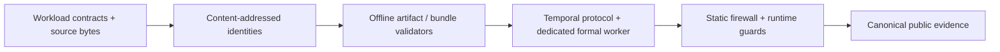

<!-- lang: zh-TW -->
# Model Delivery Control Plane

> 把「模型表現較好」與「模型可以取得 production traffic」分開：offline score 不等於 deployment permission。

## 30 秒理解這個專案

Model Delivery Control Plane（MDCP）是一個 evidence-gated model delivery reference
implementation。它示範如何把 workload contract、content-addressed identity、offline
validation、temporal leakage controls、dedicated formal worker 與 fail-closed evidence boundary
串成一條可審查的 delivery path。

目前具體 workload 是 bike-demand **temporal regression**。這個 repository 展示的 delivery
controls 可轉用於 ML、AI、Computer Vision 與 LLM engineering，但不把架構可轉用性誤寫成已經
完成那些 workload。

## 目前完成度

| Surface | Status | 可驗證內容 |
|---|---|---|
| Workload contracts 與 serving identity | Implemented | strict schemas、source/content digests、identity isolation |
| Offline artifact、bundle 與 temporal validation | Verified locally | deterministic fixtures、完整測試與 security gates |
| Dedicated formal worker 與 static firewall | Verified locally | bounded subprocess transport、recovery seal、AST/capability pins |
| Control service、router、canary、rollback、recovery | Designed only | architecture/specification，沒有 end-to-end deployment claim |
| GitHub release workflow | Not executed remotely | checked-in workflow 可供 inspection；本 slice 未執行 remote release |

## 實際 implemented verification path



完整的 actual-vs-designed 說明與 component matrix 請見
[Architecture](docs/architecture.md)。

## Reviewer fast path

初次建立 dependency environment（若本機沒有 cached packages，這一步可能使用 network）：

```powershell
uv sync --frozen --group ml
```

之後執行 CPU-only、無資料集、無模型執行、無 Docker、verification 期間無 network 的 warm path：

```powershell
pwsh ./scripts/reviewer-fast-path.ps1
```

預期 warm target 為 3–5 分鐘。完整前置條件、shell-neutral commands 與 full-suite path 請見
[Reviewer quickstart](docs/reviewer/quickstart.md)。

## Evidence 與安全邊界

- Machine-readable local readiness：[local-release-readiness.json](evidence/public/portfolio/local-release-readiness.json)
- Historical public receipt：[search-receipt.json](evidence/public/v02/search/search-receipt.json)
- Historical public index：[evidence-index.json](evidence/public/v02/search/evidence-index.json)
- Evidence taxonomy 與可主張範圍：[Release evidence guide](docs/reviewer/release-evidence.md)
- Security assumptions 與攻擊面：[Threat model](docs/threat-model.md)
- Remote workflow 僅供檢視：[release-ci.yml](.github/workflows/release-ci.yml)

Technical formal closure 是 immutable historical commit
`b1bb0d80cd40e6f39372c0a45892500cc9530712`；後續 publication-only commits 是它的 descendants，
不會把新的 README HEAD 假裝成 freeze HEAD。H2 維持 `SEALED_NOT_LOADED`，loaded rows 為 `0`。

## Architecture 與程式碼導覽

- `src/mdcp/contracts`：workload contract 與 serving identity boundary
- `src/mdcp/validator`、`src/mdcp/verify`：offline artifact 與 release-bundle validation
- `src/mdcp/temporal`：temporal development protocol、formal worker、firewall 與 evidence gates
- `tests/contract`、`tests/security`、`tests/integration`：可重現 contract/security/process verification
- [Architecture](docs/architecture.md)：Implemented verification path 與 Designed deployment path

## 技術棧與測試

Python 3.12、Pydantic 2、RFC 8785 canonical JSON、pytest、Hypothesis、ONNX Runtime、Git、
PowerShell 7 與 GitHub Actions。historical technical closure 的完整測量是
`1546 passed, 7 skipped in 681.43s`；publication tree 必須以當次實際測試結果為準，不能把這個
歷史時間當成保證。

## Claim ceiling

- 未執行 remote release，也沒有 push、tag、GitHub Release 或 GHCR publication evidence。
- 不宣稱 Kubernetes production readiness。
- 不宣稱 production HA、multi-region 或 disaster recovery。
- 沒有 real production incident evidence。
- H2 未執行；`SEALED_NOT_LOADED` 不等於 confirmatory result。
- 不宣稱已實作 CV 或 LLM workload；目前實作是 temporal regression。
- 不宣稱支援任意 model framework 或 task。
- local/synthetic PASS 不等於 production evidence。

## License

本專案程式碼採 [MIT License](LICENSE)。第三方 dependency、dataset 或其他材料仍保留其各自
授權條款，不因本 repository 的專案授權而改變。
