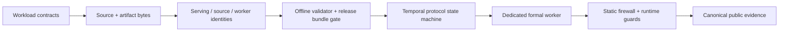
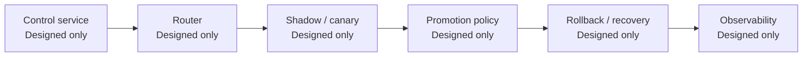

# MDCP Architecture：Actual 與 Designed 邊界

這份文件描述目前 repository 可直接驗證的工程面，不把完整 platform design 誤寫成已部署系統。
具體 workload 是 bike-demand temporal regression；MDCP 的 delivery controls 可轉用於其他 ML
domains，但這不是 CV 或 LLM application implementation 的證明。

## Implemented verification path

這條 path 的核心不是「metric 變好就部署」，而是：候選物先符合 closed contract，再由 immutable
identity、offline validation、process isolation、capability firewall 與 evidence completeness 逐層
授權。formal worker 的 process transport 與 public evidence scanner 都採 fail-closed semantics。

## Designed deployment path

上圖是設計方向，不是 end-to-end runtime deployment。repository 不宣稱 production HA、
不宣稱 multi-region、real incident recovery 或 Kubernetes production readiness。GitHub release workflow
已 checked in 供 inspection，但在此 slice 中是 Not executed remotely。

## Component matrix

| component | state | evidence |
|---|---|---|
| workload contracts and serving identity | Implemented | src/mdcp/contracts, contract tests |
| offline artifact and bundle validator | Verified locally | src/mdcp/validator, src/mdcp/verify |
| dedicated temporal formal worker | Verified locally | src/mdcp/temporal/formal_worker.py |
| public search freeze | Verified locally | evidence/public/v02/search |
| GitHub release workflow | Not executed remotely | .github/workflows/release-ci.yml |
| control service | Designed only | v0.1 design specification |
| router | Designed only | v0.1 design specification |
| canary | Designed only | v0.1 design specification |
| rollback | Designed only | v0.1 design specification |
| recovery | Designed only | v0.1 design specification |

## Historical freeze 與 publication commits

Technical formal closure 固定為
`b1bb0d80cd40e6f39372c0a45892500cc9530712`，direct parent 是
`407f68b63c06a17ef54d5ec17722ef1f801b1689`。public receipt/index 透過兩輪分離的 D/D 與 A/A
commits 保留 tombstone/refreeze topology；中間另有一個四檔 corrective commit。

README、reviewer guide、License 與 local readiness evidence 的 publication commits 都是 closure
的 descendants。它們改善 public review surface，但不重新定義 historical freeze HEAD，也不改變
serving/source/worker/firewall identities。

回到 [README](../README.md)，或查看 [Reviewer quickstart](reviewer/quickstart.md) 與
[Threat model](threat-model.md)。
