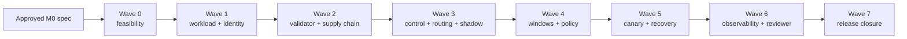

# Model Delivery Control Plane Implementation Plan

> **For agentic workers:** REQUIRED SUB-SKILL: Use superpowers:subagent-driven-development (recommended) or superpowers:executing-plans to implement this plan task-by-task. Steps use checkbox (`- [ ]`) syntax for tracking.

**Goal:** Deliver Model Delivery Control Plane v0.1 through eight evidence-gated implementation waves without weakening the approved specification.

**Architecture:** One Python 3.12 package supplies four custom runtime roles: control service, router, predictor, and ephemeral validator/replay commands. PostgreSQL is the durable decision source; MLflow provides lineage; Prometheus and exactly three Grafana dashboards expose bounded observability; Docker Compose is the only v0.1 deployment profile.

**Tech Stack:** Python 3.12, FastAPI, Pydantic v2, SQLAlchemy 2, psycopg 3, Alembic, PostgreSQL 16, NumPy, pandas, scikit-learn, ONNX/ONNX Runtime, MLflow, cryptography Ed25519, RFC 8785 canonical JSON, httpx, Prometheus, Grafana, Docker Compose, PowerShell, pytest, Hypothesis, and GitHub Actions.

## Global Constraints

- The approved normative source is `docs/superpowers/specs/2026-08-23-model-delivery-control-plane-design.md` at commit `6bfa2e6781f1f1ba6fbcd13833c5e3b03691f28f`; plans may not silently revise it.
- Docker Compose is the only v0.1 deployment profile. Kubernetes, k3d, Argo Rollouts, service mesh, Kafka, OPA, cloud deployment, persistent trace backends, and a custom administration UI are excluded.
- Reviewer acceptance is CPU-only with 8 GB available RAM, no GPU, no UCI download, no retraining, no GitHub CLI, no paid API, and no Kubernetes.
- Each predictor has exactly 1.0 CPU, a 384 MiB hard memory limit, and a 256 MiB policy threshold.
- The measured profile is a fixed single-row Bike request at 80 admissions/second, at most 32 in flight, with at least 200 excluded warm-ups per predictor.
- Authoritative memory evidence is Linux cgroup v2 `memory.peak`; unavailable or non-resettable evidence is `UNKNOWN`, never RSS.
- Router polling and RPC deadline are 500 ms, the local lease is at most 1.5 seconds, and the external rollback convergence SLA is 2 seconds.
- H1/H2 use 2,000 paired calendar-day cluster resamples with `numpy.random.Generator(PCG64(2026))`; overall point/UCB ratios are at most 0.97 and every fixed subgroup point/UCB ratio is at most 1.05 with `n >= 100`.
- Natural evidence and injected evidence use distinct processes, revisions, windows, receipts, and claims.
- Runtime databases, credentials, raw UCI data, generated model/build caches, and private evidence remain outside Git.
- Git author and committer are `kuotunyu <61350295+kuotunyu@users.noreply.github.com>`.
- Every source-changing implementation task follows red-green TDD, ends with a scoped commit, and stops on a failed wave gate. Wave 7 Task 7.5 is the sole no-source external-publication task: it moves a prewritten acceptance check from red to green and deliberately creates no post-release commit, preserving exact source/OCI/tag identity.
- No external GitHub mutation is authorized by these plans alone; the authorization matrix below governs every remote action.
- RTX 4090 and paid Google Colab are optional developer conveniences and are not v0.1 requirements or acceptance dependencies.

---

## Wave-to-milestone map

| Wave | Plan | Spec milestone | Entry gate | Completion gate | Immutable input to next wave |
|---|---|---|---|---|---|
| 0 | `2026-08-23-mdcp-wave-0-foundation-feasibility.md` | M0 implementation-readiness extension | Approved spec and clean local repository | All seven feasibility tasks PASS; aggregate report verdict is `PASS`; no threshold substitution | Locked toolchain, capability report, resource budget, cgroup contract, crypto vectors, transaction proof |
| 1 | `2026-08-23-mdcp-wave-1-workload-identity.md` | M1 | Wave 0 PASS | Leakage, split, reproducible ONNX, H1 evidence, MLflow numeric-version snapshot, descriptor identity PASS | Bike schemas, frozen split/feature manifests, predictor contract, stable/candidate artifacts, descriptor schemas/vectors |
| 2 | `2026-08-23-mdcp-wave-2-validator-supply-chain.md` | M2 | Wave 1 immutable identities | Validator/adversarial/offline-verifier tests PASS and owner-authorized real GHCR/attestation evidence verifies | Validation receipt, final-manifest schema, bundle-index schema, immutable OCI/supply-chain evidence bundle |
| 3 | `2026-08-23-mdcp-wave-3-control-routing-shadow.md` | M3 | Waves 0–2 PASS | Bootstrap, atomic state/route/audit, signed route API, lease/cache, deterministic routing, non-blocking shadow, delayed labels PASS | Core DB migrations, signed route-plan API, router/predictor contracts, durable paired evidence |
| 4 | `2026-08-23-mdcp-wave-4-windows-policy.md` | M4 | Wave 3 paired evidence contract | Immutable sealing, duplicate/lateness handling, cluster bootstrap, subgroup/label completeness, drift and `UNKNOWN` property tests PASS | Sealed-window schema/digests, policy evaluator, quality/drift receipts |
| 5 | `2026-08-23-mdcp-wave-5-canary-recovery.md` | M5 | Wave 4 policy/window PASS | Exact canary denominators, stages, rollback/quarantine/manual safety, convergence and two-window recovery PASS | Canary/recovery state, decision receipts, golden rollback evidence |
| 6 | `2026-08-23-mdcp-wave-6-observability-reviewer.md` | M6 | Wave 5 end-to-end control behavior | Three dashboards, Compose review profile, offline demo, 212.5-second request budget and <=300-second warm wall time PASS | Provisioned dashboards, warm reviewer fixtures/images, measured demo receipt and resource report |
| 7 | `2026-08-23-mdcp-wave-7-release-closure.md` | M7 | Waves 0–6 PASS and owner authorizes each external action | Full clean-clone/security/publication matrix PASS; authorized `v0.1.0` evidence and claims reviewed | Portfolio-complete source release, OCI/attestation chain, asset-only public receipts, exact-source tag/Release |

## Normative spec coverage map

Every top-level normative section has an owning wave and a closure check. Section ranges below are references to the approved design specification; they are not new requirements.

| Spec section | Primary wave ownership | Closure evidence |
|---|---|---|
| §1–§5 purpose, claims, differentiation, scope, principles | W7; constraints enforced in W0–W6 | claim scanner, excluded-scope scan, evidence-first README |
| §6 architecture and end-to-end flow | W1, W3, W6 | role contracts, Compose topology, architecture/traceability tests |
| §7–§8 workload, leakage, fixtures, natural evidence | W1 | checksum/split/leakage tests, deterministic ONNX fixtures, H1 report |
| §9 immutable identity and MLflow boundary | W1, W2 | descriptor/manifest/bundle schemas, numeric MLflow snapshot, identity-chain verifier |
| §10–§11 state machine, bootstrap, routing, lease, convergence | W3, W5 | PostgreSQL constraints, atomic transition tests, signed plan/cache/restart tests |
| §12 validation and release CI | W2, W7 | isolation/adversarial tests, real authorized GHCR/attestation receipt, final exact-commit chain |
| §13 shadow quality | W3, W4 | paired event lifecycle, delayed labels, H2 bootstrap/subgroup gates |
| §14 canary SLO and drift | W4, W5, W6 | denominator/quantile/drift properties, measured cgroup evidence, reviewer replay |
| §15 evidence windows | W3, W4 | migrations, sealed-window immutability, duplicate/lateness/UNKNOWN tests |
| §16 promotion, rollback, recovery | W5 | stage progression, atomic rollback/quarantine, convergence and two-window recovery |
| §17 failure scenarios/evidence classes | W5, W6 | isolated natural/injected revisions, golden rollback receipt, demo assertions |
| §18 decision receipt and audit | W3, W5 | append-only audit transaction and offline decision-receipt verification |
| §19–§20 observability and reviewer fast path | W6 | metrics catalogue, exactly three dashboards, CPU-only warm demo under 300 seconds |
| §21 security boundary | W0, W2, W6, W7 | no-socket probes, validator isolation, Compose network tests, tracked-content/secret scans |
| §22 testing and traceability | W0–W7 | red-green task cycles, complete CI matrix, requirement-to-evidence CSV |
| §23 M0–M7 milestones | index plus matching W0–W7 plan | wave entry/completion gates and immutable handoff inventory |
| §24 completion criteria | W7 | clean clone, claims, security, local/remote preflight and publication tests |
| §25 resource/cost boundary | W0, W6, W7 | 8-GB feasibility report, disk/network/runtime measurements, published limits |
| §26 risks and mitigations | W0–W7 | fail-closed gate per risk; no threshold substitution |
| §27 rejected v0.1 decisions | W0, W7 | prohibited-scope scan and publication claim test |
| §28 review focus | W7 | full traceability matrix and owner-gated release checklist |

## Dependency graph and critical path



The acceptance critical path is strictly `W0 -> W1 -> W2 -> W3 -> W4 -> W5 -> W6 -> W7`. No wave may be declared complete in parallel with its predecessor because every completion gate emits content-addressed inputs consumed by the next wave. Within Wave 0, GitHub capability research may run alongside local cgroup/transaction probes. Within Wave 6, the three dashboard implementations may be developed in parallel after the metric catalogue is frozen. Wave 7 documentation drafting may start after Wave 2, but Wave 7 testing, external actions, and completion remain blocked on Wave 6.

## External-state authorization boundaries

| Boundary | Earliest wave | Read-only work allowed without new approval | Mutation requiring explicit owner approval | Stop condition |
|---|---:|---|---|---|
| GitHub repository creation | 2 | Inspect official GitHub documentation and validate local workflow syntax | Create `kuotunyu/model-delivery-control-plane`, configure visibility/settings/secrets, and push the exact reviewed Task 2.6 source/workflow commit | Stop Wave 2 before API/UI/CLI create or initial push until owner grants A1 repository/bootstrap authority |
| Git source branch push | 7 | Compare local/remote SHAs and run all local preflight checks | Push the exact final Task 7.4 commit to `main` | Stop final release dispatch until the owner grants source-push authority and remote `main` resolves to the preflight SHA |
| GHCR push | 2 | Build locally, calculate local image digest, validate subject names syntactically | Authenticate and push any manifest/blob to `ghcr.io/kuotunyu/model-delivery-control-plane` | Stop Wave 2 before registry login/push until owner approves repository and GHCR publication; request again for final Wave 7 subject |
| GitHub artifact attestation | 2 | Validate workflow permissions, subject/digest fixtures, and offline attestation parser | Run a workflow that writes a real GitHub attestation | Stop Wave 2 before workflow dispatch until owner approves attestation generation; request again for final Wave 7 subject |
| Git tag | 7 | Validate proposed tag `v0.1.0`, commit identity, and clean-tree gate locally | Create or push `v0.1.0` | Obtain separate tag approval after M7 preflight PASS |
| GitHub Release | 7 | Render release notes and verify local release bundle | Publish or modify the GitHub Release | Obtain separate release approval after tag and published evidence verify |

Approval for one boundary does not authorize a later boundary. A failed external check records evidence and stops; it never rewrites policy, thresholds, denominators, or claims.

## Resource, network, and schedule estimate

| Resource | Wave estimate | Reviewer/release ceiling |
|---|---|---|
| CPU | Development: 4–8 logical cores; predictors capped at 1.0 CPU each | Reviewer remains CPU-only; no GPU requirement |
| RAM | Control 256 MiB, router 256 MiB, each predictor 384 MiB, PostgreSQL 512 MiB, MLflow 768 MiB, Prometheus 384 MiB, Grafana 384 MiB, replay/validator 384 MiB, Docker overhead reserve 2.5 GiB | Expected peak about 6.2 GiB; must remain operable with 8 GB available RAM |
| Disk | Locked environment/cache 1.2 GiB, images 2.0 GiB, volumes/evidence 1.0 GiB, fixtures/reports 0.3 GiB | Runtime volumes and project artifacts stay below the 5 GB spec target |
| Network | Wave 1 developer-only UCI fetch under its checksum gate; cold container/dependency acquisition estimated 2–4 GB; Wave 0 GitHub research under 100 MB | Warm reviewer path requires no network and no UCI access |
| GitHub Actions | Pull-request matrix 12–20 minutes; authorized release workflow 15–30 minutes | Quota/policy checked immediately before external authorization; no paid runner is required |
| Wall time | Wave 0: week 1; Wave 1: week 2; Wave 2: week 3; Wave 3: weeks 4–5; Wave 4: week 5; Wave 5: week 6; Wave 6: week 7; Wave 7: week 8 | Target delivery is 8 weeks; reviewer warm scenario is <=300 seconds |

RTX 4090 and Colab are deliberately absent from every gate. Using either may accelerate private experimentation, but evidence produced only on them cannot replace CPU reviewer acceptance.

## Implementation risk register

| Risk | Earliest detector | Mandatory response |
|---|---|---|
| Docker Desktop does not expose/reset the candidate cgroup v2 `memory.peak` safely | W0 cgroup probe | Fail Wave 0 and return to owner spec review; never substitute RSS |
| 1-vCPU/384-MiB enforcement or 80-rps/32-in-flight harness is not authoritative | W0 resource/load probes | Fail Wave 0 without reducing rate, latency, memory, or denominator thresholds |
| Full reviewer topology exceeds 8 GB RAM or 5 GB artifacts | W0 stack budget; W6 final Compose measurement | Stop and reduce non-normative overhead only; preserve all normative roles/evidence |
| UCI checksum, license attribution, chronology, or leakage boundary fails | W1 workload gates | Reject the fixture; never publish raw UCI or use H2 before freeze-manifest lock |
| OCI/manifest/receipt identity becomes cyclic or mutable | W2 schema/property tests; W7 exact-commit preflight | Reject publication; dynamic final digests stay in immutable workflow/Release assets |
| GitHub capability, quota, permissions, or authorization is absent | W0 read-only research; W2/W7 authorization gates | Record `BLOCKED_EXTERNAL_AUTHORIZATION`; do not emulate real attestation with local evidence |
| Windows scheduling variance makes natural latency nondeterministic | W0 load probe; W6 natural/injected separation | Report natural result honestly; use the separately labeled deterministic failure profile only to prove control behavior |
| Telemetry/dashboard outage is mistaken for decision evidence loss | W3 durable events; W6 outage tests | PostgreSQL remains decision source; dashboards degrade without inventing PASS |
| Router restart or stale lease extends candidate exposure | W3 cache/restart tests; W5 convergence set | Enter stable-only after lease expiry and keep recovery pending until restart-safe evidence passes |
| Public repository leaks local paths, credentials, payloads, raw data, or private evidence | W7 tracked-tree and clean-clone gates | Block release; sanitize only non-normative metadata and prove spec §1–§28 bytes unchanged |

## Locked Python package and repository tree

The wave named in comments owns initial creation; `planning` and `M0` are already-approved documentation. Later waves may modify a file only where their exact task lists say so. This file-level tree is generated from all 316 unique implementation `Create`/`Test` paths plus the nine plan documents and approved spec; directory summaries do not conceal additional test files.

```text
.
├── .github/
│   └── workflows/
│       ├── ci.yml  # W7
│       ├── release-ci.yml  # W2
│       ├── release.yml  # W7
│       └── security.yml  # W7
├── configs/
│   ├── models/
│   │   ├── candidate-v1.yaml  # W1
│   │   └── stable-v1.yaml  # W1
│   ├── policy/
│   │   ├── canary-v1.json  # W5
│   │   ├── drift-v1.json  # W4
│   │   ├── onnx-operators-v1.json  # W2
│   │   ├── quality-v1.json  # W1
│   │   └── validation-v1.json  # W2
│   └── workload/
│       └── uci-bike-sharing-v1.json  # W1
├── constraints/
│   ├── github-actions.lock  # W2
│   ├── runtime-licenses.txt  # W2
│   └── versions.env  # W0
├── docker/
│   ├── control.Dockerfile  # W3
│   ├── predictor.Dockerfile  # W1
│   ├── replay.Dockerfile  # W6
│   ├── router.Dockerfile  # W3
│   └── validator.Dockerfile  # W2
├── docs/
│   ├── releases/
│   │   └── v0.1.0.md  # W7
│   ├── research/
│   │   └── github-supply-chain-capability.md  # W0
│   ├── superpowers/
│   │   ├── plans/
│   │   │   ├── 2026-08-23-mdcp-wave-0-foundation-feasibility.md  # planning
│   │   │   ├── 2026-08-23-mdcp-wave-1-workload-identity.md  # planning
│   │   │   ├── 2026-08-23-mdcp-wave-2-validator-supply-chain.md  # planning
│   │   │   ├── 2026-08-23-mdcp-wave-3-control-routing-shadow.md  # planning
│   │   │   ├── 2026-08-23-mdcp-wave-4-windows-policy.md  # planning
│   │   │   ├── 2026-08-23-mdcp-wave-5-canary-recovery.md  # planning
│   │   │   ├── 2026-08-23-mdcp-wave-6-observability-reviewer.md  # planning
│   │   │   ├── 2026-08-23-mdcp-wave-7-release-closure.md  # planning
│   │   │   └── 2026-08-23-model-delivery-control-plane-plan-index.md  # planning
│   │   └── specs/
│   │       └── 2026-08-23-model-delivery-control-plane-design.md  # M0
│   ├── traceability/
│   │   └── requirements.csv  # W7
│   ├── architecture.md  # W7
│   ├── evidence-claims.md  # W7
│   ├── reviewer-guide.md  # W6
│   └── threat-model.md  # W2
├── evidence/
│   └── public/
│       ├── feasibility/
│       │   ├── wave0-report.json  # W0
│       │   └── wave0-report.schema.json  # W0
│       └── reviewer/
│           ├── golden-rollback-receipt.json  # W6
│           └── timing-report.json  # W6
├── migrations/
│   ├── versions/
│   │   ├── 0001_environment_release_idempotency.py  # W3
│   │   ├── 0002_route_plan_audit.py  # W3
│   │   ├── 0003_request_evidence.py  # W3
│   │   ├── 0004_evidence_windows_policy.py  # W4
│   │   └── 0005_convergence_recovery.py  # W5
│   └── env.py  # W3
├── monitoring/
│   ├── grafana/
│   │   ├── dashboards/
│   │   │   ├── canary-comparison.json  # W6
│   │   │   ├── decision-timeline.json  # W6
│   │   │   └── release-overview.json  # W6
│   │   └── provisioning/
│   │       ├── dashboards/
│   │       │   └── dashboards.yml  # W6
│   │       └── datasources/
│   │           └── prometheus.yml  # W6
│   └── prometheus/
│       └── prometheus.yml  # W6
├── schemas/
│   └── v1/
│       ├── artifact-descriptor.schema.json  # W1
│       ├── bike-request.schema.json  # W1
│       ├── decision-receipt.schema.json  # W5
│       ├── evidence-event.schema.json  # W3
│       ├── final-release-manifest.schema.json  # W2
│       ├── prediction-response.schema.json  # W1
│       ├── release-ci-bundle-index.schema.json  # W2
│       ├── route-plan.schema.json  # W3
│       ├── sealed-window.schema.json  # W4
│       └── validation-receipt.schema.json  # W2
├── scripts/
│   ├── demo.ps1  # W6
│   ├── feasibility.ps1  # W0
│   ├── release-ci-local.ps1  # W2
│   ├── release-preflight.ps1  # W7
│   └── verify-clean-clone.ps1  # W7
├── src/
│   └── mdcp/
│       ├── common/
│       │   ├── canonical.py  # W0
│       │   ├── digests.py  # W0
│       │   └── enums.py  # W1
│       ├── config/
│       │   ├── logging.py  # W0
│       │   └── settings.py  # W0
│       ├── contracts/
│       │   ├── events.py  # W3
│       │   ├── receipts.py  # W5
│       │   ├── release.py  # W1
│       │   ├── route.py  # W3
│       │   ├── windows.py  # W4
│       │   └── workload.py  # W1
│       ├── control/
│       │   ├── api_evidence.py  # W3
│       │   ├── api_releases.py  # W3
│       │   ├── api_routes.py  # W3
│       │   ├── app.py  # W3
│       │   ├── canary_policy.py  # W5
│       │   ├── dependencies.py  # W3
│       │   ├── metrics.py  # W6
│       │   ├── quality_policy.py  # W4
│       │   ├── reconciliation.py  # W3
│       │   ├── recovery_service.py  # W5
│       │   ├── route_signing.py  # W3
│       │   ├── state_machine.py  # W3
│       │   ├── transitions.py  # W3
│       │   └── window_service.py  # W4
│       ├── db/
│       │   ├── audit.py  # W3
│       │   ├── base.py  # W3
│       │   ├── environment.py  # W3
│       │   ├── evidence.py  # W3
│       │   ├── idempotency.py  # W3
│       │   ├── recovery.py  # W5
│       │   ├── releases.py  # W3
│       │   ├── routing.py  # W3
│       │   └── session.py  # W3
│       ├── feasibility/
│       │   ├── __init__.py  # W0
│       │   ├── cgroup.py  # W0
│       │   ├── gate.py  # W0
│       │   ├── load_probe.py  # W0
│       │   ├── resource_probe.py  # W0
│       │   ├── stack_probe.py  # W0
│       │   ├── synthetic_predictor.py  # W0
│       │   └── transaction_probe.py  # W0
│       ├── observability/
│       │   └── metric_names.py  # W6
│       ├── policy/
│       │   ├── cluster_bootstrap.py  # W1
│       │   ├── denominators.py  # W5
│       │   ├── drift.py  # W4
│       │   └── quantiles.py  # W5
│       ├── predictor/
│       │   ├── app.py  # W1
│       │   ├── fault_profiles.py  # W5
│       │   ├── metrics.py  # W6
│       │   └── runtime.py  # W1
│       ├── replay/
│       │   ├── cli.py  # W6
│       │   ├── labels.py  # W3
│       │   ├── measurement.py  # W6
│       │   ├── request_ids.py  # W3
│       │   ├── scenarios.py  # W5
│       │   └── scheduler.py  # W6
│       ├── router/
│       │   ├── accounting.py  # W3
│       │   ├── app.py  # W3
│       │   ├── assignment.py  # W3
│       │   ├── metrics.py  # W6
│       │   ├── proxy.py  # W3
│       │   ├── route_cache.py  # W3
│       │   ├── route_client.py  # W3
│       │   └── shadow.py  # W3
│       ├── validator/
│       │   ├── cli.py  # W2
│       │   ├── identity_checks.py  # W2
│       │   ├── isolation.py  # W2
│       │   ├── onnx_checks.py  # W2
│       │   ├── policy.py  # W2
│       │   ├── service.py  # W2
│       │   └── supply_chain.py  # W2
│       ├── verify/
│       │   ├── bundle.py  # W2
│       │   ├── cli.py  # W2
│       │   ├── publication.py  # W7
│       │   └── receipt.py  # W5
│       ├── workload/
│       │   ├── cli.py  # W1
│       │   ├── dataset.py  # W1
│       │   ├── evaluation.py  # W1
│       │   ├── features.py  # W1
│       │   ├── mlflow_lineage.py  # W1
│       │   ├── onnx_export.py  # W1
│       │   ├── splits.py  # W1
│       │   └── training.py  # W1
│       └── __init__.py  # W0
├── tests/
│   ├── contract/
│   │   ├── compose/
│   │   │   └── test_compose_contract.py  # W6
│   │   ├── control/
│   │   │   ├── test_evidence_api.py  # W3
│   │   │   └── test_route_plan_schema.py  # W3
│   │   ├── observability/
│   │   │   ├── test_dashboards.py  # W6
│   │   │   └── test_metrics_endpoints.py  # W6
│   │   ├── router/
│   │   │   ├── test_route_api.py  # W3
│   │   │   └── test_router_api.py  # W3
│   │   ├── validator/
│   │   │   ├── test_evidence_labels.py  # W2
│   │   │   ├── test_receipt_schema.py  # W2
│   │   │   └── test_release_schemas.py  # W2
│   │   └── workload/
│   │       ├── test_descriptor_schema.py  # W1
│   │       ├── test_json_schemas.py  # W1
│   │       └── test_predictor_api.py  # W1
│   ├── feasibility/
│   │   ├── sql/
│   │   │   └── atomic_transition_probe.sql  # W0
│   │   ├── cgroup_probe.py  # W0
│   │   ├── test_atomic_transaction.py  # W0
│   │   ├── test_cgroup_contract.py  # W0
│   │   ├── test_crypto_subprocess.py  # W0
│   │   ├── test_github_research.py  # W0
│   │   ├── test_load_probe.py  # W0
│   │   ├── test_stack_budget.py  # W0
│   │   └── test_wave0_gate.py  # W0
│   ├── fixtures/
│   │   ├── artifacts/
│   │   │   ├── adversarial/
│   │   │   │   └── fixture-index.json  # W2
│   │   │   ├── candidate/
│   │   │   │   ├── artifact-descriptor.json  # W1
│   │   │   │   └── model.onnx  # W1
│   │   │   └── stable/
│   │   │       ├── artifact-descriptor.json  # W1
│   │   │       └── model.onnx  # W1
│   │   ├── crypto/
│   │   │   ├── route-plan-v1.canonical.hex  # W0
│   │   │   ├── route-plan-v1.json  # W0
│   │   │   ├── route-plan-v1.public.hex  # W0
│   │   │   ├── route-plan-v1.signature.hex  # W0
│   │   │   └── routing-buckets-v1.json  # W3
│   │   ├── reviewer/
│   │   │   ├── fault-plan-v1.json  # W5
│   │   │   ├── golden-receipt.json  # W5
│   │   │   ├── request-schedule-v1.json  # W6
│   │   │   └── synthetic-labels-v1.json  # W6
│   │   ├── supply-chain/
│   │   │   ├── adversarial/
│   │   │   │   └── fixture-index.json  # W2
│   │   │   ├── recorded-release-ci/
│   │   │   │   ├── attestation.json  # W2
│   │   │   │   ├── bundle-index.json  # W2
│   │   │   │   ├── final-release-manifest.json  # W2
│   │   │   │   ├── provenance.json  # W2
│   │   │   │   ├── release-ci-verification.json  # W2
│   │   │   │   ├── release-inventory.json  # W2
│   │   │   │   ├── sbom.spdx.json  # W2
│   │   │   │   ├── validation-receipt.json  # W2
│   │   │   │   └── vulnerability-scan.json  # W2
│   │   │   └── valid/
│   │   │       ├── attestation.json  # W2
│   │   │       ├── bundle-index.json  # W2
│   │   │       ├── final-release-manifest.json  # W2
│   │   │       ├── provenance.json  # W2
│   │   │       ├── sbom.spdx.json  # W2
│   │   │       ├── validation-receipt.json  # W2
│   │   │       └── vulnerability-scan.json  # W2
│   │   └── workload/
│   │       ├── bootstrap-vector.json  # W1
│   │       ├── chronology-sample.csv  # W1
│   │       ├── drift-reference.json  # W4
│   │       ├── freeze-manifest.json  # W1
│   │       ├── h2-quality-fail.json  # W4
│   │       ├── h2-quality-pass.json  # W4
│   │       ├── h2-quality-unknown.json  # W4
│   │       ├── single-row.json  # W1
│   │       └── synthetic-h1-report.json  # W1
│   ├── integration/
│   │   ├── compose/
│   │   │   └── test_stack_health.py  # W6
│   │   ├── control/
│   │   │   ├── test_bootstrap_transaction.py  # W3
│   │   │   ├── test_canary_lifecycle.py  # W5
│   │   │   ├── test_control_restart.py  # W3
│   │   │   ├── test_convergence_set.py  # W5
│   │   │   ├── test_db_constraints.py  # W3
│   │   │   ├── test_delayed_labels.py  # W3
│   │   │   ├── test_event_ordering.py  # W4
│   │   │   ├── test_failure_injection.py  # W5
│   │   │   ├── test_manual_override.py  # W5
│   │   │   ├── test_migrations.py  # W3
│   │   │   ├── test_quality_windows.py  # W4
│   │   │   ├── test_quarantine_transaction.py  # W5
│   │   │   ├── test_recovery.py  # W5
│   │   │   ├── test_rollback_transaction.py  # W5
│   │   │   ├── test_sealed_window_immutability.py  # W4
│   │   │   ├── test_shadow_lifecycle.py  # W3
│   │   │   ├── test_shadow_pause_resume.py  # W4
│   │   │   ├── test_shadow_to_canary.py  # W4
│   │   │   ├── test_transition_atomicity.py  # W3
│   │   │   └── test_window_migration.py  # W4
│   │   ├── observability/
│   │   │   └── test_dashboard_queries.py  # W6
│   │   ├── replay/
│   │   │   └── test_request_schedule.py  # W6
│   │   ├── reviewer/
│   │   │   ├── test_demo_contract.py  # W6
│   │   │   ├── test_observability_outages.py  # W6
│   │   │   └── test_warm_wall_time.py  # W6
│   │   ├── router/
│   │   │   ├── test_restart_convergence.py  # W5
│   │   │   ├── test_router_restart.py  # W3
│   │   │   └── test_shadow_nonblocking.py  # W3
│   │   ├── validator/
│   │   │   ├── test_mlflow_snapshot.py  # W2
│   │   │   ├── test_offline_bundle.py  # W2
│   │   │   └── test_validator_container.py  # W2
│   │   ├── test_golden_rollback.py  # W5
│   │   ├── test_mlflow_lineage.py  # W1
│   │   ├── test_onnx_parity.py  # W1
│   │   └── test_training_reproducibility.py  # W1
│   ├── property/
│   │   ├── control/
│   │   │   ├── test_canary_progression_properties.py  # W5
│   │   │   ├── test_policy_transition_properties.py  # W4
│   │   │   ├── test_safety_properties.py  # W5
│   │   │   └── test_transition_properties.py  # W3
│   │   ├── policy/
│   │   │   ├── test_canary_denominators.py  # W5
│   │   │   ├── test_drift_invariants.py  # W4
│   │   │   ├── test_event_accounting.py  # W4
│   │   │   └── test_quality_invariants.py  # W4
│   │   └── router/
│   │       └── test_single_response_source.py  # W3
│   ├── publication/
│   │   ├── test_ci_workflows.py  # W7
│   │   ├── test_claims.py  # W7
│   │   ├── test_clean_clone.py  # W7
│   │   ├── test_release_notes.py  # W7
│   │   ├── test_release_preflight.py  # W7
│   │   ├── test_release_publication.py  # W7
│   │   ├── test_release_workflow.py  # W2
│   │   └── test_traceability.py  # W7
│   ├── security/
│   │   ├── validator/
│   │   │   ├── test_archive_attacks.py  # W2
│   │   │   └── test_container_boundary.py  # W2
│   │   ├── test_compose_boundary.py  # W6
│   │   ├── test_secret_and_payload_leakage.py  # W7
│   │   └── test_tracked_content.py  # W7
│   └── unit/
│       ├── common/
│       │   └── test_canonical_vectors.py  # W0
│       ├── config/
│       │   └── test_settings.py  # W0
│       ├── contracts/
│       │   ├── test_artifact_descriptor.py  # W1
│       │   ├── test_final_manifest.py  # W2
│       │   └── test_window_contract.py  # W4
│       ├── control/
│       │   ├── test_canary_progression.py  # W5
│       │   ├── test_convergence.py  # W5
│       │   ├── test_hard_safeguards.py  # W5
│       │   ├── test_policy_truth_table.py  # W4
│       │   ├── test_reconciliation.py  # W3
│       │   ├── test_recovery.py  # W5
│       │   ├── test_route_signing.py  # W3
│       │   ├── test_state_machine.py  # W3
│       │   └── test_window_service.py  # W4
│       ├── observability/
│       │   └── test_metric_catalogue.py  # W6
│       ├── policy/
│       │   ├── test_canary_policy.py  # W5
│       │   ├── test_cluster_bootstrap.py  # W1
│       │   ├── test_denominators.py  # W5
│       │   ├── test_drift.py  # W4
│       │   ├── test_quality_policy.py  # W4
│       │   └── test_quantiles.py  # W5
│       ├── predictor/
│       │   └── test_fault_profiles.py  # W5
│       ├── replay/
│       │   ├── test_measurement.py  # W6
│       │   └── test_scheduler.py  # W6
│       ├── router/
│       │   ├── test_assignment.py  # W3
│       │   ├── test_proxy.py  # W3
│       │   ├── test_route_cache.py  # W3
│       │   └── test_shadow.py  # W3
│       ├── validator/
│       │   ├── test_identity_checks.py  # W2
│       │   ├── test_onnx_checks.py  # W2
│       │   ├── test_service.py  # W2
│       │   └── test_supply_chain.py  # W2
│       ├── verify/
│       │   ├── test_bundle.py  # W2
│       │   └── test_receipt.py  # W5
│       └── workload/
│           ├── test_contracts.py  # W1
│           ├── test_dataset.py  # W1
│           ├── test_evaluation.py  # W1
│           ├── test_leakage.py  # W1
│           ├── test_onnx_export.py  # W1
│           ├── test_splits.py  # W1
│           └── test_training.py  # W1
├── .dockerignore  # W0
├── .gitignore  # W0
├── .python-version  # W0
├── alembic.ini  # W3
├── CITATION.cff  # W7
├── compose.feasibility.yaml  # W0
├── compose.yaml  # W6
├── LICENSE  # W7
├── pyproject.toml  # W0
├── README.md  # W7
├── SECURITY.md  # W7
└── uv.lock  # W0
```

## Cross-wave interface catalogue

These names are immutable after their producing wave passes. A breaking change requires returning to the producer wave and invalidates downstream evidence.

| Interface | Exact name/signature or route | Producer | Consumers |
|---|---|---:|---|
| Canonical JSON | `canonicalize_json(value: JsonValue) -> bytes` | W0 | W1–W7 |
| Digest | `sha256_hex(data: bytes) -> str` and `content_digest(model: BaseModel) -> str` | W0 | W1–W7 |
| Bike request | `BikeRequest` with the 11 approved fields | W1 | predictor, router, replay, policy |
| Predictor response | `PredictionResponse(request_id, release_id, prediction, route_revision, traceparent)` | W1 | router, evidence ingest |
| Common enums | `GateVerdict(PASS, FAIL, UNKNOWN)`, `ValidationVerdict(PASS, FAIL, UNKNOWN, QUARANTINE)`, `ReleaseState`, `ExecutionRole`, `EvidenceClass`, `FaultProfile` | W1 | all later domain modules |
| Release objects | `ArtifactDescriptor`, `FinalReleaseManifest`, `ReleaseCIBundleIndex`, `ValidationCheck`, `ValidationReceipt`; `ValidationVerdict` is distinct from three-state `GateVerdict` | W1/W2 | validator, control, verifier, receipts |
| Route objects | `LeaseContract`, `RoutePlanPayload`, `SignedRoutePlan` | W3 | control and router |
| Signing | `RoutePlanSigner.sign(payload: RoutePlanPayload) -> SignedRoutePlan`; `RoutePlanVerifier.verify(plan: SignedRoutePlan) -> RoutePlanPayload` | W3 | transitions, route client/cache |
| Deterministic bucket | `route_bucket(request_id: str, release_id: str, route_revision: int, policy_routing_seed: bytes) -> int` | W3 | router, replay, frozen bucket vectors |
| Events | W3: `AdmissionEvent`, `TerminalEvent`, `DelayedLabelEvent`; W5: `RouterHeartbeat`, `RouteAcknowledgement` | W3/W5 | DB, windows, canary, replay |
| Windows | `SealedWindow`, `QualityGateResult`, `CanaryGateResult` | W4/W5 | transitions, receipt, dashboards |
| Control routes | W3: `POST /v1/environments/{environment_id}/bootstrap`, `POST /v1/releases`, `POST /v1/releases/{release_id}/transitions`, `POST /v1/evidence/events`, `POST /v1/labels`, `GET /v1/environments/{environment_id}/route-plan`; W4: `POST /v1/windows/{window_id}/seal`; W5: `POST /v1/routers/heartbeat`, `POST /v1/routers/acknowledgements` | W3–W5 | router, replay, reviewer |
| Predictor route | `POST /v1/predict`; readiness `GET /health/ready`; metrics `GET /metrics` | W1/W6 | router, Compose |
| Router route | `POST /v1/predict`; readiness `GET /health/ready`; metrics `GET /metrics` | W3/W6 | replay, reviewer |
| Bootstrap kernel | `cluster_bootstrap_ratios(rows: Sequence[PairedQualityRow], groups: Sequence[str], resamples: int = 2000, seed: int = 2026) -> BootstrapResult` | W1 | H1 and W4 H2 gates |
| Quality function | `evaluate_paired_quality(rows: Sequence[PairedQualityRow], policy: QualityPolicy) -> QualityGateResult` | W4 | shadow gate |
| Canary function | `evaluate_canary_window(events: Sequence[CanaryEvent], policy: CanaryPolicy) -> CanaryGateResult` | W5 | controller |
| Receipt | `DecisionReceipt` and `verify_decision_receipt(path: Path) -> VerificationResult` | W5 | reviewer, release closure |

## PostgreSQL schema and Alembic order

1. `0001_environment_release_idempotency.py` creates `environments`, `releases`, and `idempotency_records`; `environments.active_release_id` is nullable only while `initialized=false`.
2. `0002_route_plan_audit.py` creates `route_plans` and append-only `audit_events`; `(environment_id, revision)` is unique and revision is positive.
3. `0003_request_evidence.py` creates `request_admissions`, `terminal_events`, and `delayed_labels`; terminal identity is unique on `(request_id, release_id, execution_role, route_revision)` and exact duplicates are accounted separately.
4. `0004_evidence_windows_policy.py` creates `evidence_windows`, `window_event_members`, and `policy_evaluations`; sealed rows cannot be updated by the application role.
5. `0005_convergence_recovery.py` creates `router_instances`, `convergence_sets`, `convergence_members`, `route_acknowledgements`, `recovery_incidents`, and `recovery_windows`.

No later migration renames an earlier public column during v0.1. Additive changes require contract tests and migration upgrade/downgrade verification.

## Execution rule

Run exactly one wave at a time. At each wave boundary, execute its full completion command, review the immutable artifact inventory/digests, and obtain the owner checkpoint named in that plan. If Wave 0 reports any non-PASS feasibility gate, stop all implementation and request a normative spec review; never substitute RSS, reduce 80 rps/32 in-flight, relax 25 ms/256 MiB, shrink samples, or extend the five-minute target.
