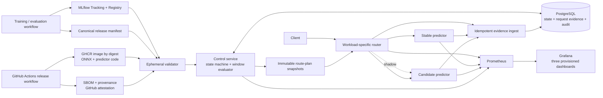
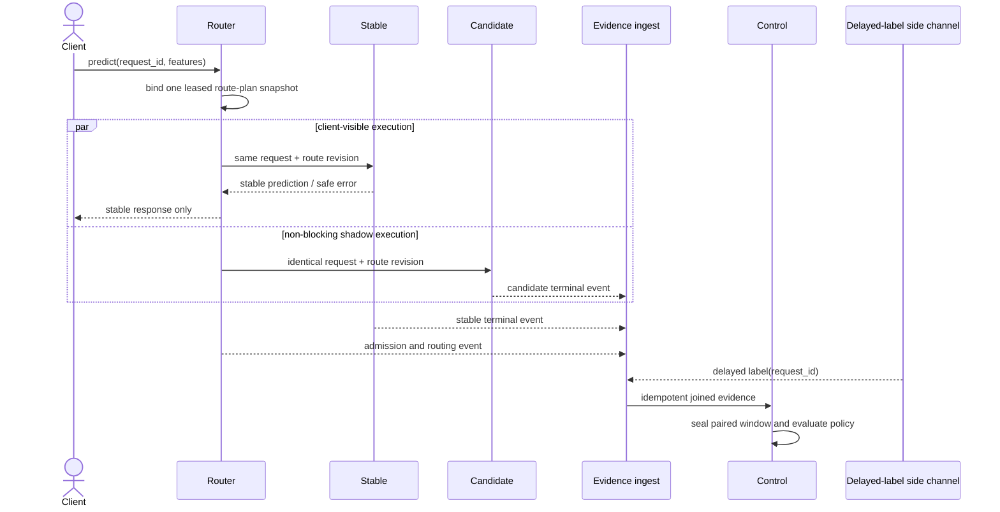

# Model Delivery Control Plane v0.1 Design Specification

- Status: proposed written specification; approved direction, pending owner review
- Date: 2026-08-23
- Local repository: `C:\Users\3Hml\Desktop\CC_github部隊\model-delivery-control-plane`
- Intended public repository: `https://github.com/kuotunyu/model-delivery-control-plane`
- Primary implementation profile: Docker Compose on Windows 11 / Docker Desktop
- Workload: UCI Bike Sharing hourly regression
- Intended audience: AI Engineer, LLM Engineer, Machine Learning Engineer, and AI Platform reviewers

## 1. Purpose

Model Delivery Control Plane is a local, reproducible reference implementation for deciding
whether an immutable model release may receive production traffic. Its central rule is:

> A model release must pass artifact integrity, supply-chain, paired shadow quality, canary
> operational SLO, and evidence-completeness gates before receiving production traffic. A better
> offline score is not deployment permission.

The project is not a training platform, generic inference gateway, Kubernetes showcase, or
production hosting service. It demonstrates the control points between an evaluated model artifact
and a justified deployment decision: release identity, validation, shadow comparison, progressive
traffic exposure, fail-closed evidence handling, automatic rollback, recovery verification, and
an auditable decision receipt.

This document is normative for v0.1. The terms **MUST**, **MUST NOT**, **SHOULD**, and **MAY** have
their usual requirements meaning. An implementation that violates a MUST or MUST NOT does not
meet the v0.1 acceptance contract.

## 2. Portfolio claim and claim ceiling

### 2.1 Claims permitted after v0.1 acceptance

After all M0-M7 acceptance milestones pass, the project MAY be described as:

- a local, reproducible model delivery control plane;
- a content-addressed immutable model-release workflow;
- a paired shadow-quality gate followed by staged canary operational gates;
- a fail-closed evidence-completeness policy;
- transactionally consistent control-plane rollback with bounded data-plane convergence;
- OCI supply-chain verification using digest, SBOM, provenance, and GitHub artifact attestation;
- an auditable and recomputable decision-receipt workflow.

### 2.2 Claims prohibited by v0.1

The project MUST NOT claim:

- production high availability or disaster recovery;
- multi-cluster, multi-region, or cloud-scale failover;
- globally instantaneous or globally atomic traffic switching;
- Kubernetes production readiness;
- generic support for arbitrary frameworks, tasks, or model formats;
- multi-tenant authentication, authorization, or isolation;
- protection against a PostgreSQL superuser or compromised trusted build workflow;
- evidence from a real production incident;
- a real-world production bike-demand system;
- that drift alone proves quality degradation;
- that canary traffic from different request populations is a paired model-quality experiment.

The precise rollback claim is **atomic control-plane rollback with bounded data-plane
convergence**.

## 3. Context and differentiation

The repository is deliberately distinct from existing portfolio projects:

- `local-inference-bench-gateway` addresses OpenAI-compatible request routing, backend failover,
  backpressure, streaming, and local inference-engine benchmarking. Model Delivery Control Plane
  MUST NOT repeat engine comparisons, generic LLM routing, ordered backend failover, or an
  OpenAI-compatible API.
- `mvtec-ad2-inspection-platform` addresses anomaly-model research, frozen category champions,
  bundle verification, leased workers, inspection evidence, and human review. Model Delivery
  Control Plane MUST NOT repeat CV training, batch inspection jobs, content-addressed inspection
  artifacts, or a review workstation.
- `CareRisk-48H` already documents the distinction between input drift and outcome-linked quality
  drift. This project applies the same scientific boundary to release decisions: insufficient or
  missing outcome labels produce `UNKNOWN`, never an implied quality pass.
- `WoundScope` already demonstrates ONNX parity and privacy-safe model handoff. This project uses
  ONNX only as a constrained delivery format and does not reproduce medical CV functionality.

The new unit of control is an immutable **release**, not a request backend, experiment run,
inspection job, or model-training trial.

## 4. v0.1 scope

### 4.1 Included

v0.1 MUST include:

- Docker Compose as the only deployment profile;
- PostgreSQL;
- MLflow Tracking and Model Registry;
- one control service containing distinct controller and policy/window modules;
- one workload-specific router;
- one predictor image contract used by stable and candidate releases;
- an ephemeral artifact-validator job or CLI;
- a replay and delayed-label harness;
- Prometheus and Grafana;
- immutable OCI image digests;
- BuildKit SBOM/provenance and GitHub artifact-attestation verification;
- shadow routing;
- `CANARY_10`, `CANARY_25`, and `CANARY_50` traffic stages;
- automatic rollback and recovery verification;
- an offline-verifiable machine-readable decision receipt;
- deterministic test-only failure profiles;
- a CPU-only reviewer path.

### 4.2 Excluded

v0.1 MUST NOT include:

- k3d or Kubernetes;
- Argo Rollouts;
- a service mesh;
- Kafka or another event broker;
- OPA or a general policy engine;
- cloud deployment;
- a persistent OpenTelemetry Collector, Tempo, or Jaeger backend;
- a custom web administration frontend;
- multi-tenant authentication or RBAC;
- online training or automatic retraining;
- a feature store;
- generic multi-framework serving;
- LLM or CV workloads;
- Hugging Face publication;
- production HA or disaster recovery.

k3d is a possible v0.2 extension. It MUST NOT be implemented, planned as a v0.1 adapter, or used as
a v0.1 completion gate before v0.1 reaches Portfolio Complete at M7.

## 5. Design principles

1. **Evidence before traffic.** A release receives no candidate traffic before its required
   evidence is valid.
2. **Content identity before aliases.** Mutable tags and MLflow aliases are navigation aids, not
   deployment authority.
3. **Paired quality before canary operations.** Quality comparison uses identical shadow requests;
   canary primarily tests operational behavior.
4. **Unknown is not pass.** Missing, conflicting, stale, or statistically insufficient evidence
   pauses progression.
5. **The safe version remains available.** A candidate is never the only runnable release during
   shadow or canary.
6. **The control path is durable.** Promotion and rollback decisions use transactionally stored
   events and sealed windows, not a Grafana query result.
7. **The data path converges, not teleports.** The database decision is atomic; router adoption is
   bounded and observable.
8. **Failure evidence is labeled.** Natural workload measurements and injected failures are never
   presented as the same evidence class.
9. **Small number of deployables.** Components split only where runtime trust or request-path
   isolation requires it.

## 6. System architecture



### 6.1 Deployable boundary

v0.1 has four custom deployable roles:

1. control service;
2. router;
3. predictor image instantiated as stable and candidate;
4. ephemeral validator and replay commands using project images.

PostgreSQL, MLflow, Prometheus, and Grafana are infrastructure services. Controller and window
evaluation MUST be separate modules in the control-service codebase but MUST NOT be split into
separate network services for v0.1.

### 6.2 Control service

The control service owns:

- release-state transitions;
- optimistic concurrency and idempotency;
- versioned policy evaluation;
- evidence ingestion and sealed windows;
- generation of immutable route-plan snapshots;
- promotion, rollback, and recovery decisions;
- reconciliation after restart or partial failure;
- audit events and decision receipts.

It depends on PostgreSQL and read-only validated release metadata. It MUST NOT load an ONNX model,
proxy inference responses, invoke Docker, mount the Docker socket, or treat MLflow aliases as
active deployment state.

### 6.3 Router

The router owns:

- request-envelope and request-ID validation;
- loading a cached immutable route-plan snapshot;
- deterministic stable/candidate bucket assignment;
- non-blocking shadow duplication;
- exactly one client-visible response source;
- request and route-revision accounting;
- propagation of request and W3C trace context;
- bounded stale-plan handling.

The router MUST NOT query PostgreSQL or MLflow on every request. It MUST NOT fail over a failed
stable request to an unapproved candidate, because doing so would mix availability behavior with a
release experiment.

### 6.4 Predictor image

Stable and candidate use the same predictor image contract. They MAY have different image digests
when serving code or dependencies differ, but every release binds both serving code and ONNX
artifact into one immutable image digest.

The predictor:

- accepts only the Bike Sharing v0.1 inference schema;
- loads only the manifest-bound ONNX artifact;
- rejects pickle, joblib, arbitrary Python import paths, and runtime model downloads;
- emits finite, non-negative demand estimates or a stable safe error envelope;
- exposes bounded operational metrics without payloads or unbounded labels;
- runs non-root with a read-only root filesystem and minimal network/filesystem access.

### 6.5 Validator

The validator is an ephemeral job or CLI. It validates an untrusted release candidate and exits.
It MUST NOT run as a long-lived service. Section 12 defines its trust and validation contract.

### 6.6 Replay harness

The replay harness supports two evidence classes:

- a synthetic reviewer scenario that requires no UCI download or training;
- the full UCI workload with chronological splits and delayed labels.

It owns deterministic request IDs, concurrency/load schedules, label delivery, and explicitly
named fault profiles. It MUST NOT write labels into predictor requests.

### 6.7 Infrastructure

- PostgreSQL is the durable source of truth for state, route revisions, request accounting,
  windows, and audit events.
- MLflow is the experiment and model-lineage interface, not deployment authority.
- Prometheus is the operational time-series store and alert/debug surface, not the sole source of
  automatic decisions.
- Grafana provides exactly three provisioned dashboards and no release mutation controls.

### 6.8 End-to-end data flow

Release flow is:

1. Training/evaluation logs a run and numeric model version to MLflow and emits the frozen model,
   split, preprocessing, evaluation, and policy evidence.
2. Release CI builds an image containing serving code and ONNX, pushes it by digest, and creates
   SBOM, provenance, attestation, scan, and release-manifest evidence.
3. The isolated validator recomputes identity and contract checks. Only a PASS receipt permits
   `VALIDATING -> VALIDATED`.
4. The control service commits a shadow route plan. Router snapshots the plan without per-request
   database access.
5. Shadow generates paired predictions; delayed labels join outside the predictor; the control
   service seals and evaluates the quality window.
6. Passing shadow opens successive canary route plans. Canary request events supply operational
   evidence, while Prometheus mirrors bounded aggregates for Grafana.
7. A gate PASS advances one stage. FAIL commits rollback; UNKNOWN commits pause. Every decision
   references immutable evidence and a monotonic route revision.

Shadow request and label flow is:



During canary, the same admission step selects exactly one client-visible predictor via the HMAC
bucket contract. No request is sent to both predictors for the purpose of claiming paired canary
quality. A rollback changes the database route revision atomically; router leases bound when new
admissions stop using the failed revision.

## 7. Workload and leakage contract

### 7.1 Dataset

v0.1 uses the UCI Bike Sharing hourly regression dataset:

- UCI dataset ID: 275;
- DOI: `10.24432/C5W894`;
- instances: 17,389;
- published feature count: 13;
- license: CC BY 4.0;
- prediction target: `cnt`.

The repository MUST include attribution, DOI, source URL, retrieved archive checksum, and a
machine-readable dataset manifest. The CPU reviewer path uses synthetic fixtures and MUST NOT
download UCI data.

### 7.2 Feature contract

The only permitted model features are:

- `season`;
- `mnth`;
- `hr`;
- `holiday`;
- `weekday`;
- `workingday`;
- `weathersit`;
- `temp`;
- `atemp`;
- `hum`;
- `windspeed`.

The following columns MUST be rejected if presented to the feature pipeline:

- `casual`;
- `registered`;
- `cnt`;
- `instant`;
- raw `dteday`;
- `yr`.

`casual` and `registered` are target-derived components of `cnt`; allowing them would be direct
target leakage. `cnt` is the target. `instant` is an index. Raw `dteday` can memorize chronology.
`yr` is excluded because the training period contains only 2011, making it constant during fit;
its 2012 value would be unseen and would encode the evaluation boundary rather than a learned,
reusable relationship.

Calendar information needed by the model is represented only through the approved categorical
fields. Raw `dteday` is available only to the data-governance layer for chronological assignment
and is removed before feature transformation. Subgroup membership is computed outside the model
feature pipeline from the approved request fields and fixed policy definitions.

### 7.3 Chronological split

- 2011 rows: training only.
- 2012-01-01 through 2012-06-30: offline validation and policy calibration.
- 2012-07-01 through 2012-12-31: sealed replay traffic.

All thresholds, subgroup definitions, random seeds, preprocessing configuration, policy digest,
and candidate-selection rule MUST be committed to a freeze manifest before any 2012 H2 label or
aggregate result is loaded. The H2 data loader MUST require the freeze-manifest digest.

H2 labels MAY be revealed to the evaluator only through the delayed-label side channel after
requests have been routed. Predictors and the router MUST NOT receive H2 labels.

### 7.4 Leakage tests

The following are release-blocking tests:

1. The final transformed input lineage originates only from the feature allowlist.
2. `casual`, `registered`, `cnt`, `instant`, raw `dteday`, and `yr` are rejected at schema and
   pipeline construction boundaries.
3. Training timestamps end before 2012-01-01; validation timestamps are within H1; replay
   timestamps are within H2.
4. Scalers, encoders, imputers, and learned preprocessing state are fit only on 2011 rows.
5. Subgroup definitions are functions of request features and policy configuration, never target
   values or predictions.
6. The training and policy-calibration code path cannot import or enumerate H2 files before the
   freeze manifest exists.
7. Dataset, split, preprocessing, and freeze manifests are hash-bound into the release manifest.

Stable and candidate are delivery fixtures. Their purpose is to create realistic release evidence,
not to establish a state-of-the-art bike-demand model.

## 8. Model fixtures and natural evidence

The stable fixture is a constrained Random Forest regressor with bounded tree count and depth. The
candidate fixture is a larger Random Forest configuration intended to offer a plausible quality,
size, memory, and latency trade-off. Exact hyperparameters become part of the training-config
digest and cannot change after H1 policy calibration.

Both pipelines MUST export to ONNX, pass the same input/output schema, and serve through the same
predictor contract. The project MUST record, without predetermined outcome:

- offline and paired-shadow overall MAE;
- prespecified subgroup MAE;
- latency distribution under the fixed CPU contract;
- process/cgroup memory;
- ONNX artifact size;
- OCI image size.

The natural candidate is not required to trigger rollback. Its measured result MUST be reported as
PASS, FAIL, or UNKNOWN exactly as produced by the frozen policy. Thresholds MUST NOT be altered to
manufacture a more dramatic result.

## 9. Immutable release identity and MLflow boundary

### 9.1 Canonical release ID

Every release has:

```text
release_id = sha256(RFC-8785-canonical-release-manifest-without-release_id)
```

The manifest MUST bind:

- registered model name and MLflow numeric model version;
- MLflow source run ID;
- ONNX SHA-256, byte size, opset, and operator inventory;
- input- and output-schema digests;
- Git source SHA;
- training-configuration digest;
- UCI DOI, source checksum, and attribution digest;
- dataset and chronological-split manifest digests;
- preprocessing and leakage-test receipt digests;
- H1 evaluation-report digest;
- OCI fully qualified repository and image digest;
- SBOM digest;
- build-provenance and GitHub-attestation bundle digests;
- rollout-policy digest;
- manifest schema version and canonicalization version.

The self-referential `release_id` field is excluded from canonicalization. Human descriptions,
mutable aliases, local paths, and timestamps that do not affect execution MUST NOT be included in
the identity material.

### 9.2 MLflow role

MLflow stores experiments, runs, metrics, signatures, artifacts, model versions, and reviewer-facing
lineage. It MUST use a database-backed registry. The deployment controller resolves the numeric
MLflow version once during validation and snapshots its artifact URI and digests.

MLflow aliases MAY mirror `candidate` or `champion` for human navigation after a successful control
transaction. Predictors and routers MUST NOT load by alias. Reassigning an MLflow alias MUST NOT
change active traffic.

### 9.3 Active deployment identity

The environment has one singleton active-production pointer in PostgreSQL. Historical releases may
retain lifecycle state `PRODUCTION` to record that they reached production, but exactly one release
is active for current production traffic. Previous production releases remain immutable rollback
targets until retention policy removes their runnable image outside v0.1.

## 10. Release state machine

### 10.1 States

Normal progression is:

```text
SUBMITTED
  -> VALIDATING
  -> VALIDATED
  -> SHADOW
  -> CANARY_10
  -> CANARY_25
  -> CANARY_50
  -> PRODUCTION
```

Exception states are:

- `REJECTED`: a pre-client-visible-traffic quality, contract, or non-security eligibility failure,
  including paired shadow failure;
- `PAUSED`: evidence is incomplete, stale, conflicting, or statistically insufficient;
- `ROLLED_BACK`: a release that received client-visible canary or production traffic was returned
  to zero traffic;
- `QUARANTINED`: artifact-integrity or supply-chain trust failure.

`REJECTED`, `ROLLED_BACK`, and `QUARANTINED` are terminal for that `release_id`. Correcting the
artifact, policy, or evidence creates a new manifest and release ID. `PAUSED` is resumable only to
the stage captured in its `resume_state`. Entering `PAUSED` commits a new route revision with stable
at 100% and candidate/shadow at 0%; pause preserves the candidate for a new comparable evidence
window but does not continue experimental traffic.

### 10.2 Allowed transitions

| Previous state | Allowed next state | Required evidence or action |
|---|---|---|
| none | `SUBMITTED` | Unique release ID and idempotent submission |
| `SUBMITTED` | `VALIDATING` | Validator job accepted |
| `VALIDATING` | `VALIDATED` | Artifact, offline eligibility, and supply-chain gates PASS |
| `VALIDATING` | `REJECTED` | Non-security validation or offline eligibility FAIL |
| `VALIDATING` | `QUARANTINED` | Digest, signature, provenance, forbidden format, or trust failure |
| `VALIDATED` | `SHADOW` | Stable release healthy; shadow route plan committed |
| `SHADOW` | `CANARY_10` | Paired shadow quality and evidence-completeness PASS |
| `SHADOW` | `PAUSED` | Required evidence UNKNOWN |
| `SHADOW` | `REJECTED` | Paired quality or shadow runtime gate FAIL before client-visible candidate traffic |
| `SHADOW` | `QUARANTINED` | New integrity or supply-chain failure |
| `CANARY_10` | `CANARY_25` | Stage operational window PASS |
| `CANARY_25` | `CANARY_50` | Stage operational window PASS |
| `CANARY_50` | `PRODUCTION` | Stage operational window and all cumulative gates PASS |
| any canary state | `PAUSED` | Required evidence UNKNOWN |
| any canary state | `ROLLED_BACK` | Operational gate FAIL or safe manual rollback |
| any canary state | `QUARANTINED` | Integrity or supply-chain failure |
| `PAUSED` | recorded `resume_state` | Cause resolved; a new evidence window is opened |
| `PAUSED` | `REJECTED` | Safe termination when `resume_state` is `VALIDATED` or `SHADOW` |
| `PAUSED` | `ROLLED_BACK` | Safe termination when `resume_state` is a canary or `PRODUCTION` |
| `PAUSED` | `QUARANTINED` | Integrity or trust failure discovered |
| `PRODUCTION` | `ROLLED_BACK` | Post-promotion rollback-window gate FAIL or safe manual rollback |
| `PRODUCTION` | `QUARANTINED` | Critical integrity or trust failure |

No other transition is valid. An invalid transition MUST fail closed and create a safe audit event
without changing state or route plan.

### 10.3 Transition concurrency contract

Every transition command MUST include:

- release ID;
- expected previous state;
- expected route revision;
- policy digest;
- evidence-window ID where applicable;
- globally unique idempotency key;
- actor or service identity;
- reason code.

The PostgreSQL transaction MUST lock the environment and release rows, verify the expected state
and revision, apply the state/weight change, increment route revision, append the decision event,
and store the receipt reference. A unique idempotency constraint MUST return the original result for
an exact retry and MUST reject a reused key with different content.

A database uniqueness constraint on the singleton environment row MUST ensure exactly one active
production pointer. Duplicate evaluator results MUST resolve to the previously committed transition
or a no-op stale-result event; they MUST NOT advance two stages.

### 10.4 Manual override

v0.1 has no RBAC system. A local operator MAY issue a safety-reducing override only:

- pause a release;
- reduce candidate weight;
- terminate a pre-canary release as rejected or initiate rollback after client-visible candidate
  traffic.

An override MUST record actor, reason, creation time, expiry time, previous route revision, and
resulting route revision. Maximum duration for a temporary pause or weight reduction is 24 hours.
An expired temporary override is reconciled to the latest policy-safe state. A rollback override is
terminal for that release; its expiry equals its commit time and never schedules restoration.
v0.1 manual override MUST NOT promote, bypass `UNKNOWN`, or release a quarantined artifact.

## 11. Routing contract

### 11.1 Deterministic assignment

The router MUST NOT use a language built-in hash. It computes:

```text
digest = HMAC-SHA256(
    policy_routing_seed,
    UTF8(request_id) || 0x00 || UTF8(release_id) || 0x00 || UINT64_BE(route_revision)
)
bucket = UINT64_BE(digest[0:8]) mod 10_000
```

Bucket mapping is half-open and exact:

- `CANARY_10`: candidate for buckets `[0, 1000)`; stable otherwise;
- `CANARY_25`: candidate for buckets `[0, 2500)`; stable otherwise;
- `CANARY_50`: candidate for buckets `[0, 5000)`; stable otherwise;
- `PRODUCTION`: active production for buckets `[0, 10000)`;
- shadow: stable is client-visible for all buckets and candidate receives a duplicate for all
  accepted requests.

The routing seed is a non-secret, versioned policy value. It exists for deterministic distribution,
not cryptographic access control. The same request ID, release ID, and route revision MUST select the
same bucket across process restarts, Python versions, Windows/Linux hosts, and architectures.

### 11.2 Request snapshot and stickiness

Each accepted request binds exactly one immutable route-plan snapshot at admission. Retries with the
same request ID and route revision are sticky. The request event records the route revision, bucket,
selected client-visible release, optional shadow release, and disposition.

Exactly one predictor response may become client-visible. Shadow output is never eligible to replace
a stable error or timeout.

### 11.3 Route-plan cache and convergence

The router polls the control service for a new route plan every 500 ms. It never queries PostgreSQL
directly. A successful fetch installs a fully validated immutable snapshot and starts a 2-second
monotonic lease. PostgreSQL `LISTEN/NOTIFY` MAY later reduce typical propagation time, but bounded
polling and the lease are the v0.1 contract and require no additional infrastructure.

If the router cannot refresh before lease expiry, it MUST enter stable-only safe mode: new requests
use the last known active stable release and no candidate or shadow traffic is emitted. A router
without any previously validated stable release is not ready and rejects requests with a controlled
503 response.

For healthy local services, any request admitted more than 2 seconds after a committed rollback MUST
not be routed to the candidate. This is the **router convergence SLA**. The controller exposes
acknowledged route revisions for every router instance; recovery is not confirmed until all healthy
routers acknowledge the rollback revision.

### 11.4 In-flight requests

A request admitted before rollback continues under its bound snapshot. It is not cancelled or
rerouted. Its completion event retains the old revision and MAY arrive after rollback. Such a result
is valid historical evidence but cannot reopen or alter a sealed decision window.

### 11.5 Stale-plan and reconciliation behavior

The router rejects route plans with:

- a lower revision than currently cached;
- an invalid signature/digest;
- an unknown release;
- weights that do not sum to 10,000 buckets;
- multiple client-visible routes for one bucket;
- a policy digest inconsistent with the release stage.

The control-service reconciliation loop runs every 5 seconds. It compares release state, active
production pointer, route plan, transition event, and router acknowledgements. It republishes an
equivalent plan idempotently or initiates safe rollback when state cannot be reconciled. Controller
restart reconstructs state from PostgreSQL; router restart begins stable-only until it obtains a
valid leased snapshot.

## 12. Artifact and supply-chain validation

### 12.1 General isolation

Candidate artifacts, manifests, images, SBOMs, and attestations are untrusted. The validator MUST:

- run as non-root;
- use a read-only root filesystem and dedicated bounded temporary storage;
- have no network after required evidence has been staged;
- have no Docker socket, host control socket, credentials, or unrelated host mounts;
- enforce CPU, memory, artifact-size, file-count, and wall-clock limits;
- emit fixed error codes without secret, payload, or host-path disclosure.

ONNX is a constrained interchange format, not a guarantee of safety. Runtime parsing and smoke
execution remain isolated and resource bounded.

### 12.2 Required checks

The validator MUST:

1. validate manifest schema and RFC 8785 canonicalization;
2. recompute the release ID and all referenced SHA-256 digests;
3. reject any OCI reference that lacks a digest or relies on a mutable tag;
4. reject pickle, joblib, Python marshal, executable archives, and arbitrary Python model loaders;
5. validate ONNX byte size, opset, graph inputs/outputs, tensor shapes, and operator allowlist;
6. reject ONNX external-data absolute paths, parent traversal, links, duplicate members, or files
   outside the staged artifact root;
7. enforce one model file and the manifest-declared bounded support files;
8. run deterministic smoke fixtures under resource and time limits;
9. verify model output is schema-valid, finite, and non-negative;
10. verify the MLflow numeric version snapshot and artifact digest;
11. verify Git source, training config, dataset, split, leakage, evaluation, and policy digests;
12. verify the GitHub attestation repository, workflow identity, commit SHA, subject name, and OCI
    digest;
13. verify BuildKit provenance and an SPDX SBOM are attached to the same OCI subject;
14. evaluate dated vulnerability and license policy;
15. produce a canonical, SHA-256-digested validation receipt whose evidence class is explicit.

### 12.3 ONNX operator policy

The v0.1 allowlist contains only operators required by the frozen preprocessing and Random Forest
graphs. The allowlist is generated from the validated stable fixture, reviewed as source, versioned
with the manifest schema, and then frozen before candidate validation. A candidate requiring an
additional operator is rejected and requires a new reviewed policy version and release ID; the
validator MUST NOT expand the allowlist automatically.

### 12.4 Vulnerability and license policy

The release scan MUST be generated within seven calendar days of the release-CI verification time.
An unexpired scan is part of the release manifest.

- Any known critical runtime vulnerability fails validation.
- A high-severity finding fails unless an exception names the vulnerability, package, affected
  version, technical rationale, owner, compensating control, and an expiry no more than 30 days in
  the future.
- Unknown or unclassified runtime-package licenses fail unless covered by a similarly documented
  exception with a maximum 30-day expiry.
- Initial permitted runtime licenses are Apache-2.0, BSD-2-Clause, BSD-3-Clause, ISC, MIT,
  MPL-2.0, and PSF-2.0. Dataset CC BY 4.0 attribution is evaluated separately from runtime-package
  redistribution.
- Expired exceptions cannot be renewed silently; renewal creates a reviewed policy digest.

### 12.5 Release CI verification

The authoritative release-CI evidence is produced by a trusted GitHub Actions workflow and includes:

- the real GHCR subject name and digest;
- GitHub artifact attestation bound to repository, workflow, triggering commit, and image digest;
- BuildKit provenance;
- an attached SPDX SBOM;
- vulnerability and license scan receipts;
- release manifest and validator receipt.

Actions MUST be pinned to full commit SHAs. Secrets MUST use secret mounts or GitHub credential
mechanisms and MUST NOT be passed as Docker build arguments. A local developer image is eligible only
for `dev/test` evidence and cannot reach `PRODUCTION` under the release policy.

### 12.6 Reviewer offline verification

The reviewer fast path does not require GitHub CLI, GHCR identity lookup, network access, or a new
online attestation check. It verifies:

- local bundle inventory and digests;
- release-manifest canonicalization and release ID;
- ONNX and fixture hashes;
- the included SBOM/provenance/attestation evidence bundle digests;
- the recorded release-CI verification receipt;
- sealed windows, decisions, route revisions, and receipt recomputation.

Offline verification proves that the reviewed bundle is internally consistent with the published
release evidence. It MUST NOT claim that the local reviewer independently re-established current
GitHub identity, transparency-log availability, or live GHCR state. Dashboard and README labels MUST
separate `release CI verified` from `reviewer locally recomputed` evidence.

## 13. Shadow quality contract

### 13.1 Paired request set

During `SHADOW`, every accepted request is sent to stable and candidate under the same request ID,
feature payload, route revision, and policy digest. Stable alone controls the client response.

Candidate execution has an independent deadline and task lifecycle. Stable completion MUST NOT await
candidate completion, telemetry flush, label arrival, or quality evaluation. Candidate timeout,
crash, or telemetry loss is recorded and may make the window FAIL or UNKNOWN, but it MUST NOT alter
the stable response.

### 13.2 Delayed labels

The label side channel publishes `request_id`, label, label-source digest, and arrival time to the
evaluator after routing. It does not call the predictor. The evaluator joins labels to both stable
and candidate predictions for the identical paired request set.

Late labels cannot modify a sealed window. If a window is `UNKNOWN` because label evidence was
insufficient, the release pauses and a replacement window may be opened after the issue is resolved.

### 13.3 Prespecified subgroups

v0.1 quality subgroups are fixed before H2 is opened:

- weather: `clear` (`weathersit=1`), `mist` (`weathersit=2`), and `adverse`
  (`weathersit in {3,4}`);
- day type: `workingday=0` and `workingday=1`;
- demand period: `peak` (`hr in {7,8,9,16,17,18}`) and `off_peak` (all other hours).

Subgroups overlap by design. Metrics are reported for every fixed group. No target value or model
prediction participates in group membership.

### 13.4 Paired quality metrics and gates

For each paired labeled request `i`:

```text
stable_error_i    = abs(stable_prediction_i - label_i)
candidate_error_i = abs(candidate_prediction_i - label_i)
paired_delta_i    = candidate_error_i - stable_error_i
```

The H1 offline eligibility gate requires:

- candidate overall MAE no greater than `0.97 * stable overall MAE`;
- each eligible subgroup candidate MAE no greater than `1.05 * stable subgroup MAE`;
- 100% finite, non-negative predictions;
- each subgroup denominator at least 100; a smaller denominator is `UNKNOWN`, not omitted.

The H2 paired-shadow promotion gate requires:

- at least 2,000 valid paired predictions overall;
- overall label completeness at least 99.5%;
- label completeness at least 99.0% within every subgroup having at least 100 expected requests;
- candidate overall MAE no greater than `0.97 * stable overall MAE`;
- the one-sided 95% paired-bootstrap upper bound for mean `paired_delta` no greater than zero;
- each eligible subgroup candidate MAE no greater than `1.05 * stable subgroup MAE`;
- no subgroup with an expected denominator of at least 100 may have a final denominator below 100;
- schema-valid, finite, non-negative candidate output for every candidate success.

The paired bootstrap uses 2,000 resamples and RNG seed 2026, samples paired request rows with
replacement, and is defined in the policy manifest before H2 access. These criteria are a release
policy for this fixture, not a general claim of statistical or operational optimality.

If overall or subgroup label missingness violates these limits, quality is `UNKNOWN` and the release
enters `PAUSED`. Non-random label loss MUST NOT be hidden by reporting only overall completeness.

## 14. Canary operational contract

### 14.1 Purpose

Canary routes a fraction of client-visible responses to candidate and primarily validates:

- output schema and errors;
- latency;
- memory and availability;
- route and event accounting;
- route-plan convergence.

Candidate and stable requests in canary are different HMAC-selected populations. A raw comparison
of their MAE MUST NOT be presented as a paired model effect. Canary quality MAY be shown as secondary
diagnostic evidence only with request-mix and subgroup denominators visible; it is not a v0.1
promotion gate.

### 14.2 Stage windows

Each stage seals two consecutive passing operational windows before progression:

| Stage | Candidate weight | Candidate responses required per window | Maximum window duration |
|---|---:|---:|---:|
| `CANARY_10` | 10% | 300 | 15 minutes |
| `CANARY_25` | 25% | 500 | 15 minutes |
| `CANARY_50` | 50% | 1,000 | 15 minutes |

A window seals when its candidate-response count is reached or its maximum duration elapses. A
duration-expired window with insufficient sample is `UNKNOWN`. Natural full-workload and synthetic
review scenarios use the same gate semantics; the synthetic scenario is labeled test evidence and
cannot replace natural workload release evidence.

### 14.3 Operational SLO

Every canary window MUST satisfy:

- candidate output-schema validity: 100%;
- candidate application error rate: at most 1.0%;
- no predictor OOM, crash, or unexpected restart;
- candidate p95 service latency: at most 25 ms under the frozen 1-vCPU reviewer/load profile;
- candidate cgroup-memory peak: at most 256 MiB;
- routed-request to terminal-event accounting completeness: at least 99.9%;
- zero conflicting duplicate terminal events;
- zero request IDs with more than one client-visible response source;
- no healthy router more than one route revision behind for longer than 2 seconds.

Stable/candidate p95 ratio and stable memory are displayed as diagnostics. A ratio gate is not
authoritative because the two canary populations are not paired. The absolute candidate SLO is the
promotion and rollback criterion.

A provisional hard safeguard MUST roll back before normal window sealing when any of the following
occurs:

- one OOM or unexpected candidate process restart;
- one request receives conflicting client-visible responses;
- candidate error rate exceeds 5% after at least 50 candidate requests;
- a validated artifact or attestation is later found inconsistent.

The resulting partial window remains in the audit receipt and is marked `FAIL`, not discarded.

### 14.4 Drift and traffic-comparability monitor

Drift is monitored but is not treated as proof of quality degradation. The frozen input reference
uses 2011 training rows from the same calendar month as the current replay request, so expected
seasonality is not confused with a candidate-specific change. Reference bins, category
probabilities, smoothing rules, and thresholds are computed from 2011 only and bound into the
policy before H2 is opened.

The monitor evaluates:

- numeric PSI for `temp`, `atemp`, `hum`, and `windspeed`, using calendar-month-specific decile
  edges and epsilon `1e-6` for empty cells;
- base-2 Jensen-Shannon divergence for `weathersit`, `workingday`, and `hr`;
- schema rejection and field-missingness rates;
- prediction-distribution summaries for stable and candidate, labeled as output drift rather than
  quality drift;
- canary stable/candidate traffic-mix denominators by the fixed quality subgroups.

A drift window requires at least 300 accepted inputs. Fewer inputs make drift `UNKNOWN`. PSI at
least 0.20 or Jensen-Shannon divergence at least 0.10 is a warning. PSI at least 0.30,
Jensen-Shannon divergence at least 0.20, schema rejection above 1.0%, or unexpected required-field
missingness makes release-window comparability `UNKNOWN` and enters `PAUSED` with candidate traffic
at zero.

Generic input drift affects the evidence environment shared by both releases. It therefore pauses
shadow/canary but does not mark the candidate `ROLLED_BACK` or assert that stable is accurate. A
candidate-specific output-schema, error, latency, memory, or paired-quality failure follows its
corresponding FAIL/rollback rule. After promotion, generic input drift creates an audit alert and
blocks new automatic release progression; it does not by itself roll production back to a model
that may be subject to the same drift.

Raw canary quality remains secondary even when traffic-mix diagnostics look similar. Traffic-mix
diagnostics may explain operational differences, but they cannot convert disjoint canary cohorts
into paired quality evidence.

## 15. Evidence-window contract

### 15.1 Required fields

Every sealed window includes:

- window ID and schema version;
- window kind: offline, shadow-quality, canary-operational, or recovery;
- release ID and stable release ID;
- route revision and policy digest;
- UTC start/end times and monotonic duration;
- expected and observed routed requests;
- accepted, completed, errored, and timed-out counts;
- exact duplicate count and conflicting duplicate count;
- missing, late, and out-of-order event counts;
- stable/candidate paired denominator;
- expected and joined label denominators;
- overall and subgroup label-completeness rates;
- subgroup expected and observed denominators;
- metric inputs and aggregate outputs required to recompute gates;
- router acknowledgement and stale-revision evidence;
- evidence digest;
- terminal `PASS`, `FAIL`, or `UNKNOWN` and reason codes.

### 15.2 Event identity and duplicates

Terminal request events are uniquely keyed by `(request_id, release_id, execution_role,
route_revision)`. An identical retry increments an exact-duplicate counter and does not change the
metric denominator. A duplicate with different status, prediction digest, latency, or response
source is a conflicting duplicate and makes the affected window `UNKNOWN`; it also raises an
integrity incident for operator review.

Out-of-order events may be ingested. Window sealing waits until its count target or duration plus a
30-second lateness allowance. Events arriving afterward are recorded as late evidence but MUST NOT
mutate the sealed window.

### 15.3 Fail-closed rules

Any of the following produces `UNKNOWN` and `PAUSED`, unless a stricter integrity rule requires
`QUARANTINED`:

- missing telemetry beyond the stage completeness threshold;
- conflicting duplicate evidence;
- stale or mismatched policy digest;
- label completeness below overall or subgroup threshold;
- insufficient overall or subgroup sample;
- missing route acknowledgements beyond the convergence SLA;
- missing artifact, stable baseline, or source evidence;
- unrecognized metric or receipt schema version.

`UNKNOWN` MUST never satisfy a promotion precondition. A new window opened after remediation gets a
new ID and cannot overwrite the unknown window.

### 15.4 Decision source versus observability source

The control service computes decisions from idempotent PostgreSQL evidence events and immutable
sealed windows. Prometheus may contain sampled or aggregated operational metrics for dashboards,
but a Prometheus outage, scrape gap, or Grafana query MUST NOT silently change a release decision.
If a metric required by policy is absent from durable events, the result is `UNKNOWN`.

## 16. Promotion, rollback, and recovery

### 16.1 Promotion prerequisites

A release may progress only when all cumulative prerequisites are PASS:

- immutable release and artifact validation;
- release-CI supply-chain verification;
- H1 offline eligibility;
- H2 paired-shadow quality;
- current canary-stage operational SLO;
- evidence completeness;
- current policy and route revision;
- healthy stable rollback target.

Promotion to `PRODUCTION` atomically updates the candidate state, active-production pointer, route
weights, route revision, audit event, and receipt reference. MLflow alias synchronization occurs
after commit and is non-authoritative; alias failure cannot roll back a valid database transaction
or change traffic.

### 16.2 Atomic control-plane rollback

One PostgreSQL transaction atomically:

- verifies expected state and route revision;
- changes candidate traffic weight to zero;
- restores the previous active stable release to 100% client-visible traffic;
- sets candidate state to `ROLLED_BACK`;
- increments route revision;
- appends the rollback decision event;
- stores the rollback-receipt reference.

This transaction does not switch every router at the same instant. Routers converge under the
2-second route-plan lease. Documentation and dashboards MUST use the phrase **atomic control-plane
rollback with bounded data-plane convergence**, not instantaneous global rollback.

### 16.3 Recovery verification

Rollback is followed by two consecutive recovery windows. Each recovery window requires:

- at least 300 stable responses;
- stable error rate at most 1.0%;
- stable p95 latency at most 25 ms under the frozen profile;
- 100% schema-valid stable responses;
- at least 99.9% request-event accounting completeness;
- all healthy routers acknowledging the rollback revision;
- zero new candidate admissions after the 2-second convergence deadline.

Rollback is recorded immediately, but incident status remains `RECOVERY_PENDING` until both windows
pass. Failure to recover becomes `UNRESOLVED`; the controller does not oscillate automatically
between candidate and stable.

### 16.4 Restart and partial-failure recovery

- Control-service restart reconstructs release state, open windows, route revision, active pointer,
  and pending reconciliation from PostgreSQL.
- Router restart accepts no candidate traffic until it obtains a valid leased plan.
- Predictor restart is an availability event. Candidate restart during canary triggers the hard
  safeguard; stable restart produces a visible service incident and never promotes candidate by
  implicit failover.
- MLflow outage blocks new validation and lineage operations but does not change an active route.
- Prometheus or Grafana outage removes dashboards but does not alter durable gate evaluation.
- PostgreSQL outage stops transitions. Routers use the current plan only until its 2-second lease
  expires, then enter stable-only safe mode.
- Replay-harness interruption leaves the current window open until its duration and lateness
  allowance end; insufficient evidence becomes `UNKNOWN`.

## 17. Failure scenarios and evidence classes

### 17.1 Natural workload evidence

Natural evidence uses the actual stable/candidate ONNX models and frozen UCI splits. It records
quality, subgroup quality, latency, RSS/cgroup memory, artifact size, and image size. No natural
outcome is predeclared. A natural candidate that passes all gates is promoted in the controlled
local experiment; a candidate that fails is rejected or rolled back according to the evidence.

### 17.2 Deterministic test-only profiles

v0.1 includes these explicitly labeled profiles:

- `latency_plus_30ms`: adds 30 ms to candidate inference after input validation;
- `error_rate`: emits deterministic candidate 5xx responses for HMAC-selected request IDs;
- `memory_pad`: allocates a bounded declared candidate memory pad without host exhaustion;
- `subgroup_corruption`: changes candidate test outputs only for a declared subgroup;
- `telemetry_drop`: omits deterministic event IDs;
- `duplicate_conflict`: submits conflicting duplicate terminal events;
- `out_of_order`: delays deterministic events past normal order;
- `stale_route_revision`: holds one test router on an expired revision.

Fault activation is part of the test route plan and appears in every event, window, dashboard, and
receipt. A release with an active test fault profile is permanently ineligible for a production
claim.

### 17.3 Golden rollback scenario

The reviewer scenario is:

1. load prebuilt synthetic stable/candidate release fixtures;
2. validate manifest, local digests, and recorded release-CI evidence;
3. run paired shadow and pass its synthetic quality fixture;
4. enter `CANARY_10` with `latency_plus_30ms` enabled for candidate;
5. seal a candidate window whose p95 exceeds 25 ms;
6. commit atomic control-plane rollback;
7. observe every healthy router converge within 2 seconds;
8. pass two stable recovery windows;
9. export and locally verify the decision receipt.

The dashboard and README MUST label this as `INJECTED FAILURE — EXPECTED TEST OUTCOME`. It MUST NOT
be described as measured natural model latency or a production incident.

## 18. Decision receipt and audit trail

### 18.1 Audit event

Every material action appends an event containing:

- event ID, schema version, and UTC timestamp;
- actor/service identity;
- release ID and stable release ID;
- previous and next state;
- previous and next route revision;
- policy digest and evidence-window IDs/digests;
- reason code and sanitized explanation;
- idempotency key;
- request/trace context where applicable;
- manual override actor, reason, and expiry where applicable;
- previous-event digest and event digest.

The application database role can insert audit events but cannot update or delete them. This makes
ordinary application mutation evident. PostgreSQL superuser compromise remains outside the claim
boundary.

### 18.2 Receipt contents

The final machine-readable decision receipt includes:

- receipt and schema version;
- release and stable manifests or their digests;
- MLflow numeric-version references;
- OCI, ONNX, SBOM, provenance, and attestation digests;
- policy and routing-seed digests;
- all sealed windows used by the decision;
- every lifecycle transition and route revision;
- rollback and router-convergence evidence when applicable;
- recovery-window evidence;
- evidence-class labels: measured workload, injected test, release-CI verified, or locally
  recomputed;
- canonical receipt digest.

An offline verifier recomputes manifest/window/receipt digests, applies the versioned policy to the
included aggregates, and confirms the recorded decision. It cannot prove that omitted raw requests
never existed or that a PostgreSQL administrator did not rewrite the source database; the receipt
proves published internal consistency within its stated evidence boundary.

## 19. Observability

### 19.1 Metrics

Prometheus receives bounded-label metrics for:

- request count, terminal status, and service-latency histograms;
- stable/candidate/shadow execution role;
- current release state and route revision;
- intended and observed route weights;
- route-plan age and router acknowledgement lag;
- candidate errors, timeouts, restarts, and cgroup memory;
- window progress, label completeness, subgroup denominators, and terminal verdict;
- transition, pause, rollback, and recovery counts/durations;
- validator results by fixed reason code.

Allowed dynamic labels are limited to release ID, execution role, stage, status class, fixed subgroup,
fixed reason code, and service name. `request_id`, payload fields, raw exception text, local paths,
tokens, and unbounded model/user strings MUST NOT be labels.

Prometheus histograms use policy-relevant latency bucket boundaries including 25 ms. Per-request IDs
remain in bounded-retention PostgreSQL evidence, not Prometheus.

### 19.2 Dashboards

Grafana contains exactly three version-controlled dashboards:

1. **Release Overview**: current release, state, policy, route revision, gate status, evidence age,
   and supply-chain class.
2. **Canary Comparison**: stable/candidate operational distributions, route/accounting
   completeness, memory, errors, and clearly labeled measured versus injected evidence.
3. **Decision Timeline**: transitions, sealed windows, pause/rollback reason, router convergence,
   and recovery.

Grafana is read-only for release control. No custom administration UI is built in v0.1.

### 19.3 Trace-context boundary

Router and predictor accept and propagate W3C `traceparent`; the project maintains an interface for
future OpenTelemetry instrumentation. v0.1 does not deploy a persistent Collector or trace backend
and does not make trace storage a completion gate. Payload and labels MUST NOT enter trace baggage.

## 20. Reviewer fast path

### 20.1 Reviewer contract

The reviewer machine requires:

- CPU only;
- 8 GB available RAM;
- Docker Desktop;
- no GPU;
- no UCI download;
- no retraining;
- no GitHub CLI;
- no Kubernetes;
- no paid API.

A single entry point, designed as `pwsh ./scripts/demo.ps1`, will orchestrate the review scenario.
This filename is a design contract, not an implementation created by this specification commit.

### 20.2 Scenario sequence

The entry point will:

1. start the Compose review profile;
2. load prebuilt stable and candidate synthetic fixtures;
3. run offline bundle and receipt verification;
4. validate the release;
5. run paired shadow;
6. start canary;
7. trigger the declared latency injection;
8. observe rollback and route convergence;
9. verify two recovery windows;
10. export and verify the decision receipt;
11. print MLflow, Grafana, and receipt locations.

Warm-image scenario execution target is at most five minutes on the stated reviewer profile. Image
pull and first-time extraction are excluded from that target and MUST be measured and reported
separately after implementation. The documentation MUST not silently combine or omit cold-start
time.

## 21. Security boundary

### 21.1 Trust zones

- **Trusted build identity**: reviewed GitHub Actions workflow and repository identity.
- **Untrusted release input**: model, manifest, MLflow artifact, OCI image, SBOM, provenance,
  attestation bundle, and scan receipts until validation passes.
- **Promotion authority**: control-service database role and local operator safety commands.
- **Data plane**: router and predictors with no promotion credential.
- **Observability plane**: Prometheus and Grafana, which can observe but cannot mutate releases.
- **Administrative boundary**: host administrator and PostgreSQL superuser are trusted and outside
  tamper-proof claims.

### 21.2 Container and network policy

- Predictor and validator run non-root, drop Linux capabilities, set `no-new-privileges`, and use a
  read-only root filesystem plus bounded temporary storage.
- Validator has no network after staging and never receives Docker socket or secrets.
- Predictor may receive traffic only from router and emit telemetry only to allowed internal
  endpoints. It cannot access MLflow, PostgreSQL, Docker, or the Internet.
- Router can read route plans from control service and call predictors. It has no MLflow or
  PostgreSQL credential.
- Grafana and MLflow bind only to the local Compose network/loopback exposure documented for the
  reviewer.
- Runtime databases, secrets, raw UCI data, request payloads, model-build caches, and generated
  artifacts remain outside Git.

### 21.3 Data and log handling

Bike Sharing data is public but request payloads are still treated as operational input. Logs and
receipts contain request IDs, digests, bounded metrics, and fixed reason codes—not complete feature
payloads or labels. Label/event detail has a bounded local retention period of seven days after a
scenario; aggregate sealed windows and receipts may be retained. A cleanup command deletes only
explicit runtime records and never recursively deletes a configured root.

### 21.4 Accepted risks

- Docker Desktop and the local host administrator are trusted.
- PostgreSQL superuser can rewrite data; hash chaining is tamper-evident, not tamper-proof.
- ONNX/runtime vulnerabilities remain possible despite validation and isolation.
- Public dependency and vulnerability feeds may be unavailable during offline review; offline
  review verifies the recorded release-CI evidence instead of pretending to refresh it.
- The system is single-host and has no HA, durable external backup, or disaster-recovery guarantee.

## 22. Testing strategy and traceability

### 22.1 Requirements traceability

Every normative requirement receives a stable requirement ID in the implementation test matrix.
Each acceptance artifact maps:

```text
requirement -> test -> command -> output artifact -> digest -> milestone
```

Test count and coverage percentage are secondary to demonstrating that every safety invariant and
portfolio claim has executable evidence.

### 22.2 Test layers

#### Unit tests

- canonical manifest and receipt hashing;
- feature allowlist and chronological split;
- paired metrics, bootstrap, subgroup completeness, and drift calculations;
- policy gate truth table, including `UNKNOWN`;
- route bucket calculation and snapshot validation;
- state-transition and reason-code validation.

#### Property and state-machine tests

- validation can never be bypassed;
- exactly one active production pointer exists;
- rollback is idempotent;
- duplicate evaluator results cannot produce duplicate transitions;
- route revision is strictly monotonic;
- `UNKNOWN` can never promote;
- a request has exactly one client-visible response source;
- receipt or event tampering fails closed;
- all generated valid transition sequences preserve invariants;
- all generated invalid transitions leave state and route unchanged.

#### Contract tests

- router request/predictor response schemas;
- route-plan schema, digest, lease, and revision behavior;
- predictor model signature and stable error envelope;
- evidence-ingest idempotency and duplicate-conflict semantics;
- MLflow numeric-version snapshot behavior;
- release-CI versus offline-review evidence labels.

#### PostgreSQL transaction and concurrency tests

- concurrent promotion attempts;
- stale expected state or route revision;
- duplicate idempotency key with equal and unequal payload;
- rollback during evaluator retry;
- singleton active-production constraint;
- audit append-only application permissions;
- control restart between transaction commit and route-plan publication.

#### Compose integration tests

- complete submit-to-production success path using synthetic fixtures;
- paired shadow with non-blocking candidate timeout;
- each canary stage and route distribution;
- rollback plus bounded router convergence;
- two-window recovery;
- MLflow, Prometheus, or Grafana outage behavior;
- PostgreSQL outage and router stable-only lease expiry.

#### Deterministic failure-injection tests

- latency, errors, bounded memory, subgroup corruption;
- missing, duplicate, conflicting, out-of-order, and late events;
- insufficient labels and subgroup-selective label loss;
- stale route plan and router restart;
- candidate crash and validator timeout.

#### Restart and recovery tests

- control-service reconstruction from committed state;
- router start without a plan;
- predictor restart during shadow and canary;
- open-window sealing after replay interruption;
- reconciliation of a committed transition whose publication acknowledgement was lost.

#### Security and adversarial tests

- mutable tags, digest mismatch, wrong subject/repository/workflow/commit identity;
- missing or expired SBOM, provenance, scan, or exception;
- pickle/joblib and unsupported ONNX operators;
- external-data path traversal, absolute paths, links, oversized files, and decompression limits;
- payload/exception/secret leakage scans;
- no Docker socket or unexpected egress;
- non-root and read-only-filesystem assertions.

#### Clean-install and clean-clone tests

- a clean public clone contains only intended source, synthetic fixtures, public aggregate
  evidence, and documentation;
- reviewer demo succeeds from published warm images without UCI or GPU;
- source install and unit tests use locked dependencies;
- no local path, credential, runtime database, raw data, or unapproved generated artifact is
  tracked.

#### Release and publication tests

- approved Git identity and no unexpected contributor trailers;
- exact source SHA, OCI digest, SBOM, provenance, attestation, and receipt linkage;
- public claims are supported by the correct evidence class;
- natural and injected evidence labels cannot be confused;
- v0.1 documents contain no Kubernetes completion claim;
- release-CI and offline-review verification boundaries remain visible.

## 23. Acceptance milestones

Milestones are evidence gates, not calendar promises.

### M0 — Contracts and specification

Acceptance:

- this design specification is reviewed and approved;
- v0.1 scope and exclusions are frozen;
- workload, leakage, release identity, state, routing, evidence, rollback, security, and claim
  contracts contain no unresolved placeholder;
- implementation plan is created only after separate owner approval.

### M1 — Workload and artifact identity

Acceptance:

- UCI attribution, checksum, chronological split, and feature allowlist pass;
- leakage tests pass;
- stable/candidate ONNX artifacts are reproducible from 2011/H1-only workflows;
- release-manifest canonicalization and immutable release ID pass tamper tests;
- natural evidence is recorded without a forced verdict.

### M2 — Validator and supply chain

Acceptance:

- untrusted artifacts are validated in the declared isolation boundary;
- forbidden model formats, operators, paths, sizes, and mutable OCI references fail closed;
- real GHCR digest, BuildKit SBOM/provenance, and GitHub attestation are verified in release CI;
- offline reviewer evidence is correctly labeled and recomputable without claiming a new online
  identity verification.

### M3 — Router and paired shadow

Acceptance:

- cross-platform HMAC bucket vectors pass;
- route snapshots are cached, leased, monotonic, and sticky;
- shadow duplicates identical requests and never delays or replaces stable responses;
- delayed-label paired quality and subgroup completeness gates pass their tests;
- missing labels produce `UNKNOWN/PAUSED`.

### M4 — Sealed windows and policy

Acceptance:

- request events are idempotent;
- duplicate conflicts, late evidence, sample limits, and policy mismatch follow this specification;
- windows seal immutably with recomputable digests;
- all promotion prerequisites are traceable from requirement to artifact;
- property tests prove `UNKNOWN` cannot promote.

### M5 — Canary, rollback, and recovery

Acceptance:

- three canary stages use exact routing weights and stage windows;
- deterministic latency injection triggers rollback without relying on natural hardware timing;
- control-plane rollback is one transaction;
- every healthy router converges within 2 seconds or enters stable-only safe mode;
- in-flight requests retain their original revision;
- two recovery windows pass before incident closure;
- retries and restarts do not duplicate progression.

### M6 — Observability and reviewer path

Acceptance:

- the three dashboards are provisioned and low-cardinality;
- decision metrics come from durable evidence rather than Grafana;
- warm-image reviewer scenario completes within five minutes on the stated profile;
- cold image pull/extraction time is reported separately;
- MLflow, Grafana, and the receipt clearly label evidence classes;
- reviewer needs no GPU, UCI, GitHub CLI, Kubernetes, or paid API.

### M7 — Release closure

Acceptance:

- full unit, property, contract, transaction, Compose, failure, recovery, security, clean-clone,
  and publication gates pass;
- the release manifest, OCI digest, supply-chain evidence, dashboards, and decision receipts point
  to the same source release;
- public claims stay within Section 2;
- source repository and release contain no private/runtime data;
- `v0.1.0` is declared Portfolio Complete only after all preceding evidence is reviewed.

Only after M7 MAY k3d be reconsidered as a separately designed v0.2 extension.

## 24. Completion criteria

v0.1 is complete only when all of the following are demonstrated:

- no candidate traffic can precede successful artifact and supply-chain validation;
- serving resolves OCI and ONNX content by digest, not mutable alias or tag;
- paired shadow quality uses identical requests and delayed labels;
- canary quality is not misrepresented as paired model evidence;
- missing, conflicting, stale, or insufficient evidence cannot promote;
- candidate shadow failure cannot affect stable client output;
- state and route revisions remain transactionally consistent under concurrency and restart;
- rollback is idempotent and routers meet the 2-second convergence SLA or fail stable-only;
- recovery is separately verified;
- decision receipts are locally recomputable and evidence-class aware;
- the reviewer path satisfies the CPU, dependency, and timing contract;
- no v0.1 acceptance gate depends on Kubernetes, GPU, UCI download, or a paid service.

## 25. Resource and cost boundary

The required architecture has no paid-cloud dependency. The intended cash cost is zero when using a
public GitHub repository, public GHCR artifacts within the account's current allowance, and local
Docker resources. Actual GitHub quota and policy remain external and MUST be checked at release time.

The reviewer profile targets 8 GB available RAM and CPU-only execution. Runtime volumes SHOULD stay
below 5 GB. RTX 4090 and paid Colab are not required for v0.1 acceptance and MUST NOT be used to hide
an inefficient reviewer path.

## 26. Major risks and mitigations

| Risk | Mitigation |
|---|---|
| Scope expands into a Kubernetes or platform tutorial | Kubernetes is explicitly excluded; M7 completes without an adapter |
| MLflow alias mutation changes traffic | Numeric version and content digest are snapshotted; aliases are non-authoritative |
| Dashboard gaps create unsafe decisions | Durable events and sealed PostgreSQL windows are the decision source |
| Canary cohorts are treated as paired quality evidence | Paired quality is completed in shadow; canary quality is secondary and labeled |
| Router convergence is overstated | 2-second lease, acknowledgements, stable-only expiry, and precise claim language |
| Natural model timing varies across reviewer hosts | Deterministic fault profiles prove rollback; natural timing is reported honestly |
| Label loss is non-random | Overall and subgroup completeness gates both fail closed |
| Duplicate/out-of-order events advance state twice | Unique event identity, conflict semantics, optimistic concurrency, and idempotency |
| Supply-chain checks cannot be repeated offline | Release-CI and offline-review evidence classes are explicitly separated |
| Hash chain is marketed as tamper-proof | PostgreSQL administrator remains trusted and outside the claim ceiling |

## 27. Decisions rejected for v0.1

- **All-Kubernetes first:** rejected because it makes local orchestration the project story and
  raises reviewer cost before the release invariants exist.
- **Cloud control plane plus local GPU worker:** rejected because the workload is CPU-sufficient and
  the network/security/cost boundary would dominate the delivery logic.
- **Separate controller and evaluator services:** rejected to avoid microservice inflation; modules
  remain isolated inside one deployable.
- **Generic model server:** rejected because one workload and one ONNX contract are easier to audit.
- **Argo Rollouts, service mesh, Kafka, and OPA:** rejected because each replaces or obscures a core
  behavior the portfolio needs to demonstrate directly.
- **Cosign in addition to GitHub attestation:** rejected for v0.1; GitHub artifact attestation and
  BuildKit SBOM/provenance provide the chosen official mechanism.
- **Persistent tracing backend:** rejected because trace context compatibility is sufficient for
  v0.1 and Prometheus/Grafana cover the required reviewer evidence.
- **Custom administration frontend:** rejected because MLflow, Grafana, CLI output, and receipts are
  adequate reviewer surfaces.

## 28. Review focus

Owner review should explicitly confirm these locked design choices before an implementation plan is
written:

1. `yr` is excluded alongside target-derived and chronology-revealing fields.
2. H1 offline policy calibration is frozen before any H2 result is loaded.
3. Paired shadow quality, not canary cohort comparison, is the authoritative online quality gate.
4. The initial quality policy uses 3% overall improvement, 5% subgroup non-regression, paired
   bootstrap, and overall/subgroup label-completeness thresholds.
5. The canary operational contract uses an absolute 25 ms p95 and 256 MiB memory cap under the
   frozen 1-vCPU profile; stable ratios are diagnostic.
6. Router snapshots poll every 500 ms, expire after 2 seconds, and fall back to stable-only.
7. Historical `PRODUCTION` lifecycle state is distinct from the singleton active-production
   pointer.
8. Manual override can only pause, reduce traffic, or roll back; it cannot promote.
9. Natural workload evidence is outcome-neutral; deterministic injected failure is the guaranteed
   rollback acceptance path.
10. k3d remains entirely outside v0.1 and is reconsidered only after M7.

No implementation work or implementation plan is authorized by this specification commit. The next
step is owner review of this written design.
