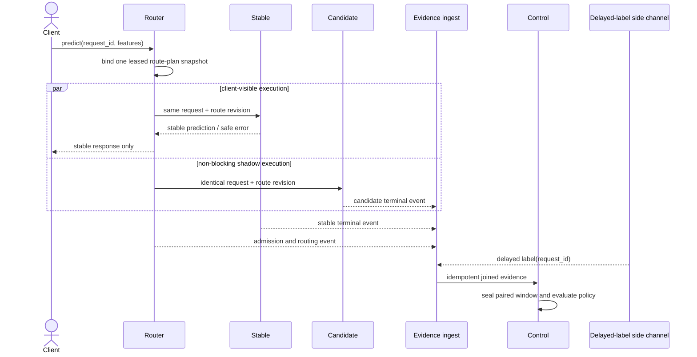

# Model Delivery Control Plane v0.1 Design Specification

- Status: approved for implementation planning
- Date: 2026-08-23
- Local repository: `C:\Users\3Hml\Desktop\CC_github部隊\model-delivery-control-plane`
- Intended public repository: `https://github.com/kuotunyu/model-delivery-control-plane`
- Primary implementation profile: Docker Compose on Windows 11 / Docker Desktop
- Workload: UCI Bike Sharing hourly regression
- Intended audience: AI Engineer, LLM Engineer, Machine Learning Engineer, and AI Platform reviewers

## 1. Purpose

Model Delivery Control Plane is a local, reproducible reference implementation for deciding
whether an immutable model release may receive production traffic. Its central rule is:

> A model release must pass artifact integrity, supply-chain, paired shadow quality, canary
> operational SLO, and evidence-completeness gates before receiving production traffic. A better
> offline score is not deployment permission.

The project is not a training platform, generic inference gateway, Kubernetes showcase, or
production hosting service. It demonstrates the control points between an evaluated model artifact
and a justified deployment decision: release identity, validation, shadow comparison, progressive
traffic exposure, fail-closed evidence handling, automatic rollback, recovery verification, and
an auditable decision receipt.

This document is normative for v0.1. The terms **MUST**, **MUST NOT**, **SHOULD**, and **MAY** have
their usual requirements meaning. An implementation that violates a MUST or MUST NOT does not
meet the v0.1 acceptance contract.

## 2. Portfolio claim and claim ceiling

### 2.1 Claims permitted after v0.1 acceptance

After all M0-M7 acceptance milestones pass, the project MAY be described as:

- a local, reproducible model delivery control plane;
- a content-addressed immutable model-release workflow;
- a paired shadow-quality gate followed by staged canary operational gates;
- a fail-closed evidence-completeness policy;
- transactionally consistent control-plane rollback with bounded data-plane convergence;
- OCI supply-chain verification using digest, SBOM, provenance, and GitHub artifact attestation;
- an auditable and recomputable decision-receipt workflow.

### 2.2 Claims prohibited by v0.1

The project MUST NOT claim:

- production high availability or disaster recovery;
- multi-cluster, multi-region, or cloud-scale failover;
- globally instantaneous or globally atomic traffic switching;
- Kubernetes production readiness;
- generic support for arbitrary frameworks, tasks, or model formats;
- multi-tenant authentication, authorization, or isolation;
- protection against a PostgreSQL superuser or compromised trusted build workflow;
- evidence from a real production incident;
- a real-world production bike-demand system;
- that drift alone proves quality degradation;
- that canary traffic from different request populations is a paired model-quality experiment.

The precise rollback claim is **atomic control-plane rollback with bounded data-plane
convergence**.

## 3. Context and differentiation

The repository is deliberately distinct from existing portfolio projects:

- `local-inference-bench-gateway` addresses OpenAI-compatible request routing, backend failover,
  backpressure, streaming, and local inference-engine benchmarking. Model Delivery Control Plane
  MUST NOT repeat engine comparisons, generic LLM routing, ordered backend failover, or an
  OpenAI-compatible API.
- `mvtec-ad2-inspection-platform` addresses anomaly-model research, frozen category champions,
  bundle verification, leased workers, inspection evidence, and human review. Model Delivery
  Control Plane MUST NOT repeat CV training, batch inspection jobs, content-addressed inspection
  artifacts, or a review workstation.
- `CareRisk-48H` already documents the distinction between input drift and outcome-linked quality
  drift. This project applies the same scientific boundary to release decisions: insufficient or
  missing outcome labels produce `UNKNOWN`, never an implied quality pass.
- `WoundScope` already demonstrates ONNX parity and privacy-safe model handoff. This project uses
  ONNX only as a constrained delivery format and does not reproduce medical CV functionality.

The new unit of control is an immutable **release**, not a request backend, experiment run,
inspection job, or model-training trial.

## 4. v0.1 scope

### 4.1 Included

v0.1 MUST include:

- Docker Compose as the only deployment profile;
- PostgreSQL;
- MLflow Tracking and Model Registry;
- one control service containing distinct controller and policy/window modules;
- one workload-specific router;
- one predictor image contract used by stable and candidate releases;
- an ephemeral artifact-validator job or CLI;
- a replay and delayed-label harness;
- Prometheus and Grafana;
- immutable OCI image digests;
- BuildKit SBOM/provenance and GitHub artifact-attestation verification;
- shadow routing;
- `CANARY_10`, `CANARY_25`, and `CANARY_50` traffic stages;
- automatic rollback and recovery verification;
- an offline-verifiable machine-readable decision receipt;
- deterministic test-only failure profiles;
- a CPU-only reviewer path.

### 4.2 Excluded

v0.1 MUST NOT include:

- k3d or Kubernetes;
- Argo Rollouts;
- a service mesh;
- Kafka or another event broker;
- OPA or a general policy engine;
- cloud deployment;
- a persistent OpenTelemetry Collector, Tempo, or Jaeger backend;
- a custom web administration frontend;
- multi-tenant authentication or RBAC;
- online training or automatic retraining;
- a feature store;
- generic multi-framework serving;
- LLM or CV workloads;
- Hugging Face publication;
- production HA or disaster recovery.

k3d is a possible v0.2 extension. It MUST NOT be implemented, planned as a v0.1 adapter, or used as
a v0.1 completion gate before v0.1 reaches Portfolio Complete at M7.

## 5. Design principles

1. **Evidence before traffic.** A release receives no candidate traffic before its required
   evidence is valid.
2. **Content identity before aliases.** Mutable tags and MLflow aliases are navigation aids, not
   deployment authority.
3. **Paired quality before canary operations.** Quality comparison uses identical shadow requests;
   canary primarily tests operational behavior.
4. **Unknown is not pass.** Missing, conflicting, stale, or statistically insufficient evidence
   pauses progression.
5. **The safe version remains available.** A candidate is never the only runnable release during
   shadow or canary.
6. **The control path is durable.** Promotion and rollback decisions use transactionally stored
   events and sealed windows, not a Grafana query result.
7. **The data path converges, not teleports.** The database decision is atomic; router adoption is
   bounded and observable.
8. **Failure evidence is labeled.** Natural workload measurements and injected failures are never
   presented as the same evidence class.
9. **Small number of deployables.** Components split only where runtime trust or request-path
   isolation requires it.

## 6. System architecture

```mermaid
flowchart LR
    Train["Training / evaluation workflow"] --> MLflow["MLflow Tracking + Registry"]
    Train --> Descriptor["Image artifact descriptor\nsource + ONNX + schema + serving config"]

    Descriptor --> CI["GitHub Actions release workflow"]
    CI --> OCI["GHCR image by digest\nONNX + predictor code + descriptor"]
    OCI --> Supply["SBOM + provenance\nGitHub attestation"]
    Supply --> Manifest["Final canonical release manifest\nand release_id"]

    MLflow --> Validator["Ephemeral validator"]
    Manifest --> Validator
    OCI --> Validator
    Supply --> Validator
    Validator --> Bundle["Sealed release-CI evidence bundle"]

    Bundle --> Control["Control service\nstate machine + window evaluator"]
    Control <--> DB[("PostgreSQL\nstate + request evidence + audit")]
    Control --> RoutePlan["Immutable route-plan snapshots"]

    Client --> Router["Workload-specific router"]
    RoutePlan --> Router
    Router --> Stable["Stable predictor"]
    Router -. "shadow" .-> Candidate["Candidate predictor"]
    Router --> Candidate

    Router --> EventIngest["Control-service endpoint/module\nidempotent evidence ingest"]
    Stable --> EventIngest
    Candidate --> EventIngest
    EventIngest --> Control

    Router --> Metrics["Prometheus"]
    Stable --> Metrics
    Candidate --> Metrics
    Control --> Metrics
    Metrics --> Dashboards["Grafana\nthree provisioned dashboards"]
```



### 6.1 Deployable boundary

v0.1 has four custom deployable roles:

1. control service;
2. router;
3. predictor image instantiated as stable and candidate;
4. ephemeral validator and replay commands using project images.

PostgreSQL, MLflow, Prometheus, and Grafana are infrastructure services. Controller and window
evaluation MUST be separate modules in the control-service codebase but MUST NOT be split into
separate network services for v0.1. `EventIngest` in the diagram is an endpoint and module inside
the control-service deployable, not a fifth custom deployable or a direct database writer.

### 6.2 Control service

The control service owns:

- release-state transitions;
- optimistic concurrency and idempotency;
- versioned policy evaluation;
- an idempotent evidence-ingest endpoint/module and sealed windows;
- generation of immutable route-plan snapshots;
- promotion, rollback, and recovery decisions;
- reconciliation after restart or partial failure;
- audit events and decision receipts.

It depends on PostgreSQL and read-only validated release metadata. It MUST NOT load an ONNX model,
proxy inference responses, invoke Docker, mount the Docker socket, or treat MLflow aliases as
active deployment state.

### 6.3 Router

The router owns:

- request-envelope and request-ID validation;
- loading a cached immutable route-plan snapshot;
- deterministic stable/candidate bucket assignment;
- non-blocking shadow duplication;
- exactly one client-visible response source;
- request and route-revision accounting;
- propagation of request and W3C trace context;
- bounded stale-plan handling.

The router MUST NOT query PostgreSQL or MLflow on every request. It MUST NOT fail over a failed
stable request to an unapproved candidate, because doing so would mix availability behavior with a
release experiment.

### 6.4 Predictor image

Stable and candidate use the same predictor image contract. They MAY have different image digests
when serving code or dependencies differ, but every release binds both serving code and ONNX
artifact into one immutable image digest.

The predictor:

- accepts only the Bike Sharing v0.1 inference schema;
- loads only the image-artifact-descriptor-bound ONNX artifact;
- rejects pickle, joblib, arbitrary Python import paths, and runtime model downloads;
- emits finite, non-negative demand estimates or a stable safe error envelope;
- exposes bounded operational metrics without payloads or unbounded labels;
- runs non-root with a read-only root filesystem and minimal network/filesystem access.

### 6.5 Validator

The validator is an ephemeral job or CLI. It validates an untrusted release candidate and exits.
It MUST NOT run as a long-lived service. Section 12 defines its trust and validation contract.

### 6.6 Replay harness

The replay harness supports two evidence classes:

- a synthetic reviewer scenario that requires no UCI download or training;
- the full UCI workload with chronological splits and delayed labels.

It owns deterministic request IDs, concurrency/load schedules, label delivery, and explicitly
named fault profiles. It MUST NOT write labels into predictor requests.

### 6.7 Infrastructure

- PostgreSQL is the durable source of truth for state, route revisions, request accounting,
  windows, and audit events.
- MLflow is the experiment and model-lineage interface, not deployment authority.
- Prometheus is the operational time-series store and alert/debug surface, not the sole source of
  automatic decisions.
- Grafana provides exactly three provisioned dashboards and no release mutation controls.

### 6.8 End-to-end data flow

Release flow is:

1. Training/evaluation logs a run and numeric model version to MLflow and emits the frozen model,
   split, preprocessing, evaluation, and policy evidence. Release CI creates a canonical **image
   artifact descriptor** that binds Git source SHA, ONNX digest, input/output-schema digest, and
   serving-code/configuration identifier, then bakes that descriptor, ONNX, and serving code into
   the image.
2. Release CI pushes the image, resolves its immutable OCI digest, and only then generates the SPDX
   SBOM, BuildKit provenance, GitHub artifact attestation, and dated scan evidence for that OCI
   subject.
3. After those subjects and digests exist, CI creates the **final canonical release manifest** and
   derives `release_id`. Neither the manifest nor `release_id` is baked back into the image.
4. The isolated validator recomputes identity and contract checks and emits a validation receipt.
   Release CI then seals the **release-CI evidence bundle** containing the final manifest, supply-chain
   objects/verification results, and that receipt. The control service verifies bundle integrity;
   only an included PASS validation receipt permits `VALIDATING -> VALIDATED`.
5. The control service commits a shadow route plan. Router snapshots the plan without per-request
   database access.
6. Shadow generates paired predictions; delayed labels join outside the predictor; the control
   service seals and evaluates the quality window.
7. Passing shadow opens successive canary route plans. Canary request events supply operational
   evidence, while Prometheus mirrors bounded aggregates for Grafana.
8. A gate PASS advances one stage. FAIL commits rollback; UNKNOWN commits pause. The runtime
   **decision receipt** references the final release identity, immutable evidence, and monotonic
   route revisions; it is distinct from release-CI evidence.

Shadow request and label flow is:



During canary, the same admission step selects exactly one client-visible predictor via the HMAC
bucket contract. No request is sent to both predictors for the purpose of claiming paired canary
quality. A rollback changes the database route revision atomically; router leases bound when new
admissions stop using the failed revision.

## 7. Workload and leakage contract

### 7.1 Dataset

v0.1 uses the UCI Bike Sharing hourly regression dataset:

- UCI dataset ID: 275;
- DOI: `10.24432/C5W894`;
- instances: 17,389;
- published feature count: 13;
- license: CC BY 4.0;
- prediction target: `cnt`.

The repository MUST include attribution, DOI, source URL, retrieved archive checksum, and a
machine-readable dataset manifest. The CPU reviewer path uses synthetic fixtures and MUST NOT
download UCI data.

### 7.2 Feature contract

The only permitted model features are:

- `season`;
- `mnth`;
- `hr`;
- `holiday`;
- `weekday`;
- `workingday`;
- `weathersit`;
- `temp`;
- `atemp`;
- `hum`;
- `windspeed`.

The following columns MUST be rejected if presented to the feature pipeline:

- `casual`;
- `registered`;
- `cnt`;
- `instant`;
- raw `dteday`;
- `yr`.

`casual` and `registered` are target-derived components of `cnt`; allowing them would be direct
target leakage. `cnt` is the target. `instant` is an index. Raw `dteday` can memorize chronology.
`yr` is excluded because the training period contains only 2011, making it constant during fit;
its 2012 value would be unseen and would encode the evaluation boundary rather than a learned,
reusable relationship.

Calendar information needed by the model is represented only through the approved categorical
fields. Raw `dteday` is available only to the data-governance layer for chronological assignment
and is removed before feature transformation. Subgroup membership is computed outside the model
feature pipeline from the approved request fields and fixed policy definitions.

### 7.3 Chronological split

- 2011 rows: training only.
- 2012-01-01 through 2012-06-30: offline validation and policy calibration.
- 2012-07-01 through 2012-12-31: sealed replay traffic.

All thresholds, subgroup definitions, random seeds, preprocessing configuration, policy digest,
and candidate-selection rule MUST be committed to a freeze manifest before any 2012 H2 label or
aggregate result is loaded. The H2 data loader MUST require the freeze-manifest digest.

H2 labels MAY be revealed to the evaluator only through the delayed-label side channel after
requests have been routed. Predictors and the router MUST NOT receive H2 labels.

### 7.4 Leakage tests

The following are release-blocking tests:

1. The final transformed input lineage originates only from the feature allowlist.
2. `casual`, `registered`, `cnt`, `instant`, raw `dteday`, and `yr` are rejected at schema and
   pipeline construction boundaries.
3. Training timestamps end before 2012-01-01; validation timestamps are within H1; replay
   timestamps are within H2.
4. Scalers, encoders, imputers, and learned preprocessing state are fit only on 2011 rows.
5. Subgroup definitions are functions of request features and policy configuration, never target
   values or predictions.
6. The training and policy-calibration code path cannot import or enumerate H2 files before the
   freeze manifest exists.
7. Dataset, split, preprocessing, and freeze manifests are hash-bound into the release manifest.

Stable and candidate are delivery fixtures. Their purpose is to create realistic release evidence,
not to establish a state-of-the-art bike-demand model.

## 8. Model fixtures and natural evidence

The stable fixture is a constrained Random Forest regressor with bounded tree count and depth. The
candidate fixture is a larger Random Forest configuration intended to offer a plausible quality,
size, memory, and latency trade-off. Exact hyperparameters become part of the training-config
digest and cannot change after H1 policy calibration.

Both pipelines MUST export to ONNX, pass the same input/output schema, and serve through the same
predictor contract. The project MUST record, without predetermined outcome:

- offline and paired-shadow overall MAE;
- prespecified subgroup MAE;
- latency distribution under the fixed CPU contract;
- process/cgroup memory;
- ONNX artifact size;
- OCI image size.

The natural candidate is not required to trigger rollback. Its measured result MUST be reported as
PASS, FAIL, or UNKNOWN exactly as produced by the frozen policy. Thresholds MUST NOT be altered to
manufacture a more dramatic result.

## 9. Immutable release identity and MLflow boundary

### 9.1 Four distinct identity/evidence objects

v0.1 deliberately separates four objects whose creation times and claims differ:

| Object | Created when | Required binding | Claim boundary |
|---|---|---|---|
| **Image artifact descriptor** | Before image build | Git source SHA, ONNX SHA-256, input/output-schema digest, serving-code/configuration identifier | Identifies the executable payload baked inside the image; it does not know the future OCI digest or `release_id` |
| **Final canonical release manifest** | After OCI push and supply-chain evidence creation | Descriptor digest, immutable OCI reference, lineage/evaluation/policy digests, and supply-chain evidence digests | Defines the immutable release and is the only input to `release_id` |
| **Release-CI evidence bundle** | After online release verification | Canonically indexed final manifest plus GitHub/registry verification records, SBOM, provenance, attestation, scan, and validator receipts | Shows what trusted release CI verified; it is not runtime rollout evidence |
| **Decision receipt** | During/after release-control decisions | Final release ID plus windows, transitions, route plans, rollback, convergence, and recovery evidence | Makes the runtime decision recomputable within the stated audit boundary |

The image artifact descriptor is RFC-8785 canonical JSON. Its serving-code/configuration identifier
MUST be a digest of the predictor source subset, locked runtime dependencies, entry point, and frozen
serving configuration. The descriptor is included in the OCI image beside the declared ONNX and
schema files; validator recomputation MUST show that all four bindings match the image contents and
source evidence.

### 9.2 Final canonical release ID

Only after the image has been pushed by digest and its supply-chain subjects exist does release CI
construct:

```text
release_id = sha256(RFC-8785-canonical-final-release-manifest-without-release_id)
```

The final canonical release manifest MUST bind:

- image-artifact-descriptor digest and schema version;
- registered model name, MLflow numeric model version, and MLflow source run ID;
- ONNX SHA-256, byte size, opset, and operator inventory;
- input- and output-schema digests;
- Git source SHA and serving-code/configuration identifier;
- training-configuration digest;
- UCI DOI, source checksum, and attribution digest;
- dataset and chronological-split manifest digests;
- preprocessing and leakage-test receipt digests;
- H1 evaluation-report digest;
- OCI fully qualified repository and image digest;
- SPDX SBOM digest;
- BuildKit provenance, GitHub-attestation bundle, and dated scan-receipt digests;
- rollout-policy digest;
- manifest schema version and RFC-8785 canonicalization version.

The self-referential `release_id` field is excluded from canonicalization. Human descriptions,
mutable aliases, local paths, and timestamps that do not affect execution MUST NOT be included in
the identity material. The final manifest and `release_id` MUST NOT be baked back into the image or
made subjects that the already-bound OCI attestation must attest. Any such bake-back would create a
new OCI digest and is forbidden. GitHub attestation names the OCI subject; the final manifest binds
that attestation evidence in one direction, so no self-attestation cycle exists.

At runtime, control service supplies the validated final `release_id` as read-only deployment
metadata; it is not an image layer. Predictor echoes it in evidence, while router/control cross-check
it against the signed plan and descriptor digest. A runtime value cannot redefine image identity.

### 9.3 MLflow role

MLflow stores experiments, runs, metrics, signatures, artifacts, model versions, and reviewer-facing
lineage. It MUST use a database-backed registry. The deployment controller resolves the numeric
MLflow version once during validation and snapshots its artifact URI and digests.

MLflow aliases MAY mirror `candidate` or `champion` for human navigation after a successful control
transaction. Predictors and routers MUST NOT load by alias. Reassigning an MLflow alias MUST NOT
change active traffic.

### 9.4 Active deployment identity

The environment has one singleton active-production pointer in PostgreSQL, nullable only before the
one-time bootstrap in Section 10.5. Historical releases may retain lifecycle state `PRODUCTION` to
record that they reached production, but exactly one release is active for current production
traffic after initialization. Previous production releases remain immutable rollback targets until
retention policy removes their runnable image outside v0.1.

## 10. Release state machine

### 10.1 States

Normal progression is:

```text
SUBMITTED
  -> VALIDATING
  -> VALIDATED
  -> SHADOW
  -> CANARY_10
  -> CANARY_25
  -> CANARY_50
  -> PRODUCTION
```

Exception states are:

- `REJECTED`: a pre-client-visible-traffic quality, contract, or non-security eligibility failure,
  including paired shadow failure;
- `PAUSED`: evidence is incomplete, stale, conflicting, or statistically insufficient;
- `ROLLED_BACK`: a release that received client-visible canary or production traffic was returned
  to zero traffic;
- `QUARANTINED`: artifact-integrity or supply-chain trust failure.

`REJECTED`, `ROLLED_BACK`, and `QUARANTINED` are terminal for that `release_id`. Correcting the
artifact, policy, or evidence creates a new manifest and release ID. `PAUSED` is resumable only to
the stage captured in its `resume_state`, which MUST be `VALIDATING`, `SHADOW`, or the originating
canary stage. Entering `PAUSED` from shadow/canary commits a new signed route revision with stable at
100% and candidate/shadow at 0%; a validation pause has no candidate route to remove but still
records the state transition. Pause preserves the candidate for a new comparable evidence window
but does not continue experimental traffic. `PRODUCTION` cannot enter a temporary pause: a safety
decision there is rollback or quarantine.

### 10.2 Allowed transitions

| Previous state | Allowed next state | Required evidence or action |
|---|---|---|
| none | `SUBMITTED` | Unique release ID and idempotent submission |
| `SUBMITTED` | `VALIDATING` | Validator job accepted |
| `VALIDATING` | `VALIDATED` | Artifact, offline eligibility, and supply-chain gates PASS |
| `VALIDATING` | `PAUSED` | Required validation evidence is missing, stale, incomplete, or otherwise `UNKNOWN` |
| `VALIDATING` | `REJECTED` | Non-security validation or offline eligibility FAIL |
| `VALIDATING` | `QUARANTINED` | Digest, signature, provenance, forbidden format, or trust failure |
| `VALIDATED` | `SHADOW` | Stable release healthy; shadow route plan committed |
| `SHADOW` | `CANARY_10` | Paired shadow quality and evidence-completeness PASS |
| `SHADOW` | `PAUSED` | Required evidence UNKNOWN |
| `SHADOW` | `REJECTED` | Paired quality or shadow runtime gate FAIL before client-visible candidate traffic |
| `SHADOW` | `QUARANTINED` | New integrity or supply-chain failure |
| `CANARY_10` | `CANARY_25` | Stage operational window PASS |
| `CANARY_25` | `CANARY_50` | Stage operational window PASS |
| `CANARY_50` | `PRODUCTION` | Stage operational window and all cumulative gates PASS |
| any canary state | `PAUSED` | Required evidence UNKNOWN |
| any canary state | `ROLLED_BACK` | Operational gate FAIL or safe manual rollback |
| any canary state | `QUARANTINED` | Integrity or supply-chain failure |
| `PAUSED` | `VALIDATING` | `resume_state=VALIDATING`; prerequisites rechecked and a fresh validation attempt opened |
| `PAUSED` | `SHADOW` | `resume_state=SHADOW`; prerequisites rechecked and a fresh paired window plus signed route revision opened |
| `PAUSED` | originating canary state | `resume_state` is that canary; prerequisites rechecked and a fresh operational window plus signed route revision opened |
| `PAUSED` | `REJECTED` | Safe termination when `resume_state` is `VALIDATING` or `SHADOW` |
| `PAUSED` | `ROLLED_BACK` | Safe termination when `resume_state` is a canary state |
| `PAUSED` | `QUARANTINED` | Integrity or trust failure discovered |
| `PRODUCTION` | `ROLLED_BACK` | Post-promotion rollback-window gate FAIL or safe manual rollback |
| `PRODUCTION` | `QUARANTINED` | Critical integrity or trust failure |

No other transition is valid. An invalid transition MUST fail closed and create a safe audit event
without changing state or route plan.

### 10.3 Transition concurrency contract

Every transition command MUST include:

- release ID;
- expected previous state;
- expected route revision;
- policy digest;
- evidence-window ID where applicable;
- globally unique idempotency key;
- actor or service identity;
- reason code.

The PostgreSQL transaction MUST lock the environment and release rows, verify the expected state
and revision, construct and sign the next route-plan payload for every committed lifecycle
transition (even when the safe weights are unchanged), apply the state/weight/pointer change,
increment route revision, persist the signed route plan, append the
decision event, and store the receipt reference. If signing or any persistence step fails, the whole
transaction aborts. The API can serve only a committed route-plan row. A unique idempotency
constraint MUST return the original result for an exact retry and MUST reject a reused key with
different content.

A database constraint on the singleton environment row MUST allow a null active pointer only while
`initialized=false`, and require exactly one non-null active pointer after initialization. Duplicate
evaluator results MUST resolve to the previously committed transition or a no-op stale-result event;
they MUST NOT advance two stages.

### 10.4 Manual override

v0.1 has no RBAC system. A local operator MAY issue only these safety actions:

- `PAUSE` while a release is in `VALIDATING`, `SHADOW`, or a canary state;
- `ROLLBACK` after a release has received client-visible traffic in a canary state or
  `PRODUCTION`.

An override MUST record actor, reason, creation time, expiry/review time, previous route revision,
and resulting route revision. A `PAUSE` expiry never auto-resumes traffic: the release remains
`PAUSED` and stable-only. Explicit `RESUME` must prove the recorded cause resolved, revalidate all
current prerequisites, commit a new signed route revision, and open a new window; the old window can
never continue. A rollback override is terminal for that release and never schedules restoration.
v0.1 has no arbitrary manual weight reduction. Manual action MUST NOT promote, bypass `UNKNOWN`,
reuse stale evidence, or recover/release a quarantined artifact.

### 10.5 Environment bootstrap and active-pointer invariant

Before the first normal candidate, a one-time audited `BOOTSTRAP_ENVIRONMENT` operation establishes
the baseline stable release. The baseline MUST pass the same artifact-descriptor, final-manifest,
schema, runtime-smoke, and supply-chain validation required for later candidates. Its evidence class
is `bootstrap_baseline`: it claims initial trusted/runnable eligibility only and MUST NOT claim that
the baseline passed paired shadow or canary promotion.

The initialization transaction verifies the environment has never been initialized, locks its
singleton row, sets the baseline lifecycle state to `PRODUCTION`, sets the singleton active-production
pointer to that release, creates the first signed stable-only route plan, and appends the bootstrap
audit event. Before this transaction, a zero active pointer is allowed; routers are not ready and
return a controlled 503. After it, the active pointer is never inferred from lifecycle state.

Every later release follows the complete normal state machine. Multiple historical releases may
therefore retain lifecycle state `PRODUCTION`, but exactly one singleton pointer defines current
traffic. API, router, dashboard, rollback, recovery, and reconciliation queries MUST resolve active
production through that pointer and MUST NOT use `WHERE state = 'PRODUCTION'` as an active-release
lookup. Promotion additionally requires the current active release to remain retained, runnable,
validated, and healthy as the previous-stable rollback target.

### 10.6 Quarantine routing semantics

An integrity or supply-chain trust failure is never audit-only:

- from `SHADOW` or any canary state, one transaction sets candidate/shadow weight to zero, stable to
  100%, marks the candidate `QUARANTINED`, increments revision, and stores the signed stable-only
  route plan plus audit evidence;
- from `PRODUCTION`, one transaction moves the singleton active pointer back to the retained
  previous stable, marks the affected release `QUARANTINED`, increments revision, and stores the
  signed previous-stable-only plan plus audit evidence;
- from pre-routing states, quarantine changes state and records evidence while committing a new
  signed stable-only revision; the candidate already has zero route weight, but the integrity
  decision is still visible in state and routing history.

If the required retained previous stable is unexpectedly not runnable at production quarantine,
the compromised release still receives zero new admissions and the environment becomes not ready
with controlled 503 responses; it MUST NOT continue serving the quarantined artifact or silently
select a different release. This is an incident that violates the promotion/retention invariant.

## 11. Routing contract

### 11.1 Deterministic assignment

The router MUST NOT use a language built-in hash. It computes:

```text
digest = HMAC-SHA256(
    policy_routing_seed,
    UTF8(request_id) || 0x00 || UTF8(release_id) || 0x00 || UINT64_BE(route_revision)
)
bucket = UINT64_BE(digest[0:8]) mod 10_000
```

Bucket mapping is half-open and exact:

- `CANARY_10`: candidate for buckets `[0, 1000)`; stable otherwise;
- `CANARY_25`: candidate for buckets `[0, 2500)`; stable otherwise;
- `CANARY_50`: candidate for buckets `[0, 5000)`; stable otherwise;
- `PRODUCTION`: active production for buckets `[0, 10000)`;
- shadow: stable is client-visible for all buckets and candidate receives a duplicate for all
  accepted requests.

The routing seed is a non-secret, versioned policy value. It exists for deterministic distribution,
not cryptographic access control. The same request ID, release ID, and route revision MUST select the
same bucket across process restarts, Python versions, Windows/Linux hosts, and architectures.

### 11.2 Request snapshot and stickiness

Each accepted request binds exactly one immutable route-plan snapshot at admission. Retries with the
same request ID and route revision are sticky. The request event records the route revision, bucket,
selected client-visible release, optional shadow release, and disposition.

Exactly one predictor response may become client-visible. Shadow output is never eligible to replace
a stable error or timeout.

### 11.3 Signed route-plan transaction

The route-plan payload is RFC-8785 canonical JSON and contains exactly the routing authority needed
by a router:

- environment ID and monotonic route revision;
- rollout-policy digest;
- stable and optional candidate final `release_id` values;
- exact stable/candidate/shadow bucket weights;
- UTC creation time for audit display;
- lease contract version, poll interval, RPC deadline, and maximum lease duration.

`stable release_id` always names the retained validated fallback. During canary, `candidate
release_id` names the release under evaluation. Immediately after promotion it remains the active
100%-weighted release while the stable field continues to name the retained previous stable; this
lets an expired old plan fail stable-only without selecting the just-quarantined active release. On
the next candidate submission, the current active pointer becomes that new plan's stable field and
the submitted release becomes its zero-weight candidate. The bootstrap plan is the sole special
case: it names the baseline in the stable field and has no candidate.

The control service alone holds the Ed25519 private key as a Compose secret. Routers contain only a
pinned Ed25519 public key. Its SHA-256 fingerprint is bound into the environment record and
`bootstrap_baseline` evidence. v0.1 has no online key rotation: changing the key requires an audited
environment rebootstrap procedure outside normal release transitions; silent dual-key acceptance is
forbidden.

While the transition transaction is open and after expected state/revision checks pass, the control
service constructs the next payload, RFC-8785 canonicalizes it to bytes, computes those bytes'
SHA-256 digest, signs the canonical bytes with Ed25519, and inserts payload, digest, and signature
together with the state, active-pointer/weight, revision, and audit changes. The row is not
externally visible before commit;
an aborted transaction discards the proposed payload/signature. The route-plan API serves only the
single current committed row and sets `Cache-Control: no-store`; it has no application/proxy cache
of an older active revision.

### 11.4 Route-plan cache, lease, and convergence

The router starts one poll every 500 ms and gives each control-API RPC a hard 500 ms monotonic
deadline. It never queries PostgreSQL directly. A within-deadline response may install or refresh a
fully validated immutable snapshot and gives that exact revision a maximum 1.5-second monotonic
lease. A response completing after its RPC deadline is discarded. PostgreSQL `LISTEN/NOTIFY` MAY
later reduce typical propagation time, but polling, deadline, and lease are the v0.1 contract.

A repeated response for the same revision may extend its lease only when it came from a new live,
within-deadline API response that passes digest/signature validation. A cached response, local replay,
late RPC, or already-consumed response cannot renew a lease. After a rollback commit, the control API
begins reads from the new committed current row and never initiates a response containing the old
active revision. A response whose database read completed before commit may still arrive at most
500 ms after commit; its last possible 1.5-second lease therefore expires no later than 2 seconds
after commit. The old revision cannot be refreshed indefinitely.

If the router cannot refresh before lease expiry, it MUST enter stable-only safe mode: new requests
use the last locally validated stable release from the signed plan and no candidate or shadow traffic
is emitted. A router without any previously validated stable release is not ready and rejects
requests with a controlled 503 response. A restarted router starts with no lease and admits no
candidate until it obtains the current valid signed plan.

For every route-changing commit, including rollback/quarantine, the control service snapshots a
`required_convergence_set` containing every router `(instance_id, boot_id)` that was registered,
reported ready, and sent a heartbeat within the preceding fixed 1-second pre-commit interval. The
set is immutable after commit. Passing the **router convergence SLA** requires every member to remain
ready continuously through the 2-second deadline and acknowledge the committed revision, and
requires zero candidate admissions after that deadline.

For a transition that enables or increases candidate traffic, an empty
`required_convergence_set` is `UNKNOWN` and cannot advance the release. Safety-reducing rollback or
quarantine still commits when the set is empty, but incident recovery remains pending until a router
starts stable-only and adopts the current signed revision.

A crash, readiness loss, or new `boot_id` during the deadline is recorded separately and never
removes/reclassifies the original member to make the SLA pass. Convergence remains pending/failing
until the restarted process proves stable-only startup and adopts the current signed plan; the new
boot identity is additional recovery evidence, not a replacement in the frozen set. The 2-second
claim applies only to processes that remain ready for the whole deadline, while restart safety is a
separate invariant. Dashboards and receipts expose both results.

### 11.5 In-flight requests

A request admitted before rollback continues under its bound snapshot. It is not cancelled or
rerouted. Its completion event retains the old revision and MAY arrive after rollback. Such a result
is valid historical evidence but cannot reopen or alter a sealed decision window.

### 11.6 Stale-plan and reconciliation behavior

The router rejects route plans with:

- a lower revision than currently cached;
- an invalid Ed25519 signature, digest, pinned-key fingerprint, or RFC-8785 payload;
- an unknown release;
- weights that do not sum to 10,000 buckets;
- multiple client-visible routes for one bucket;
- a policy digest inconsistent with the release stage.

The control-service reconciliation loop runs every 5 seconds. It compares release state, active
production pointer, route plan, transition event, and router acknowledgements. It republishes an
equivalent plan idempotently or initiates safe rollback when state cannot be reconciled. Controller
restart reconstructs state from PostgreSQL; router restart begins stable-only until it obtains a
valid signed leased snapshot.

## 12. Artifact and supply-chain validation

### 12.1 General isolation

Candidate artifacts, manifests, images, SBOMs, and attestations are untrusted. The validator MUST:

- run as non-root;
- use a read-only root filesystem and dedicated bounded temporary storage;
- have no network after required evidence has been staged;
- have no Docker socket, host control socket, credentials, or unrelated host mounts;
- enforce CPU, memory, artifact-size, file-count, and wall-clock limits;
- emit fixed error codes without secret, payload, or host-path disclosure.

ONNX is a constrained interchange format, not a guarantee of safety. Runtime parsing and smoke
execution remain isolated and resource bounded.

### 12.2 Required checks

The validator MUST:

1. validate the image artifact descriptor and final release manifest schemas and RFC 8785
   canonicalization;
2. recompute the descriptor digest, final release ID, and all referenced SHA-256 digests, and prove
   that the descriptor inside the OCI image matches its ONNX, schemas, and serving code/config;
3. reject any OCI reference that lacks a digest or relies on a mutable tag;
4. reject pickle, joblib, Python marshal, executable archives, and arbitrary Python model loaders;
5. validate ONNX byte size, opset, graph inputs/outputs, tensor shapes, and operator allowlist;
6. reject ONNX external-data absolute paths, parent traversal, links, duplicate members, or files
   outside the staged artifact root;
7. enforce one model file and the manifest-declared bounded support files;
8. run deterministic smoke fixtures under resource and time limits;
9. verify model output is schema-valid, finite, and non-negative;
10. verify the MLflow numeric version snapshot and artifact digest;
11. verify Git source, serving-code/configuration, training config, dataset, split, leakage,
    evaluation, and policy digests;
12. verify the GitHub attestation repository, workflow identity, commit SHA, subject name, and OCI
    digest;
13. verify BuildKit provenance and an SPDX SBOM are attached to the same OCI subject;
14. evaluate dated vulnerability and license policy;
15. produce a canonical, SHA-256-digested validation receipt whose evidence class is explicit.

### 12.3 ONNX operator policy

The v0.1 allowlist contains only operators required by the frozen preprocessing and Random Forest
graphs. The allowlist is generated from the validated stable fixture, reviewed as source, versioned
with the manifest schema, and then frozen before candidate validation. A candidate requiring an
additional operator is rejected and requires a new reviewed policy version and release ID; the
validator MUST NOT expand the allowlist automatically.

### 12.4 Vulnerability and license policy

The release scan MUST be generated within seven calendar days of the release-CI verification time.
An unexpired scan is part of the release manifest.

- Any known critical runtime vulnerability fails validation.
- A high-severity finding fails unless an exception names the vulnerability, package, affected
  version, technical rationale, owner, compensating control, and an expiry no more than 30 days in
  the future.
- Unknown or unclassified runtime-package licenses fail unless covered by a similarly documented
  exception with a maximum 30-day expiry.
- Initial permitted runtime licenses are Apache-2.0, BSD-2-Clause, BSD-3-Clause, ISC, MIT,
  MPL-2.0, and PSF-2.0. Dataset CC BY 4.0 attribution is evaluated separately from runtime-package
  redistribution.
- Expired exceptions cannot be renewed silently; renewal creates a reviewed policy digest.

### 12.5 Release CI verification

The authoritative release-CI evidence bundle is produced by a trusted GitHub Actions workflow only
after the OCI digest and supply-chain subjects exist. It includes:

- the real GHCR subject name and digest;
- GitHub artifact attestation bound to repository, workflow, triggering commit, and image digest;
- BuildKit provenance;
- an attached SPDX SBOM;
- vulnerability and license scan receipts;
- final canonical release manifest, release ID, and validator receipt.

The bundle has an RFC-8785 canonical inventory of member path, media type, byte size, and SHA-256;
the SHA-256 of that inventory is the bundle digest used by control-plane and decision receipts. The
inventory does not contain its own digest.

The workflow ordering is descriptor -> image build/push -> OCI digest -> SBOM/provenance/GitHub
attestation/scan -> final manifest/release ID -> validation -> sealed release-CI evidence bundle.
No later step mutates or rebuilds the OCI subject. A changed descriptor, image, supply-chain object,
or final manifest creates a different digest and requires a new candidate submission.

Actions MUST be pinned to full commit SHAs. Secrets MUST use secret mounts or GitHub credential
mechanisms and MUST NOT be passed as Docker build arguments. A local developer image is eligible only
for `dev/test` evidence and cannot reach `PRODUCTION` under the release policy.

### 12.6 Reviewer offline verification

The reviewer fast path does not require GitHub CLI, GHCR identity lookup, network access, or a new
online attestation check. It verifies:

- local bundle inventory and digests;
- image-descriptor and final-release-manifest canonicalization and release ID;
- ONNX and fixture hashes;
- the included SBOM/provenance/attestation evidence bundle digests;
- the recorded release-CI verification receipt;
- sealed windows, decisions, route revisions, and receipt recomputation.

Offline verification proves that the reviewed bundle is internally consistent with the published
release evidence. It MUST NOT claim that the local reviewer independently re-established current
GitHub identity, transparency-log availability, or live GHCR state. Dashboard and README labels MUST
separate `release CI verified` from `reviewer locally recomputed` evidence.

## 13. Shadow quality contract

### 13.1 Paired request set

During `SHADOW`, every accepted request is sent to stable and candidate under the same request ID,
feature payload, route revision, and policy digest. Stable alone controls the client response.

Candidate execution has an independent deadline and task lifecycle. Stable completion MUST NOT await
candidate completion, telemetry flush, label arrival, or quality evaluation. Candidate timeout,
crash, or telemetry loss is recorded and may make the window FAIL or UNKNOWN, but it MUST NOT alter
the stable response.

### 13.2 Delayed labels

The label side channel publishes `request_id`, label, label-source digest, and arrival time to the
evaluator after routing. It does not call the predictor. The evaluator joins labels to both stable
and candidate predictions for the identical paired request set.

Late labels cannot modify a sealed window. If a window is `UNKNOWN` because label evidence was
insufficient, the release pauses and a replacement window may be opened after the issue is resolved.

### 13.3 Prespecified subgroups

v0.1 quality subgroups are fixed before H2 is opened:

- weather: `clear` (`weathersit=1`), `mist` (`weathersit=2`), and `adverse`
  (`weathersit in {3,4}`);
- day type: `workingday=0` and `workingday=1`;
- demand period: `peak` (`hr in {7,8,9,16,17,18}`) and `off_peak` (all other hours).

Subgroups overlap by design. Metrics are reported for every fixed group. No target value or model
prediction participates in group membership.

### 13.4 Paired quality metrics and gates

For each schema-valid, paired, labeled request `i` in group `g` (where `overall` is also a group):

```text
stable_error_i    = abs(stable_prediction_i - label_i)
candidate_error_i = abs(candidate_prediction_i - label_i)
R_g               = mean(candidate_error_i in g) / mean(stable_error_i in g)
```

The H1 offline eligibility gate and H2 paired-shadow quality gate use the same frozen ratio method:

- overall point ratio `R_overall <= 0.97` **and** its one-sided 95% bootstrap upper confidence
  bound `UCB95_overall <= 0.97`;
- for every subgroup declared in Section 13.3, point ratio `R_g <= 1.05` **and**
  `UCB95_g <= 1.05`;
- 100% finite, non-negative predictions for successful outputs;
- at least 100 paired labeled rows in every predeclared subgroup. If any one subgroup has fewer than
  100, the entire quality gate is `UNKNOWN`; that subgroup cannot be called ineligible, omitted, or
  hidden behind an overall result;
- a positive stable-error mean for overall and every subgroup in every point/bootstrap calculation.
  A zero or non-finite ratio denominator makes the entire quality gate `UNKNOWN` rather than
  receiving a special favorable interpretation.

H1 applies this protocol to the frozen chronological H1 evaluation rows. H2 independently applies
it to the sealed paired-shadow rows; passing H1 does not waive any H2 requirement. H2 additionally
requires:

- at least 2,000 valid paired predictions overall;
- overall label completeness at least 99.5%;
- label completeness at least 99.0% within every predeclared subgroup;
- at least 100 final paired labeled rows in every predeclared subgroup regardless of its expected
  denominator;
- schema-valid, finite, non-negative candidate output for every candidate success.

### 13.5 Frozen paired calendar-day cluster bootstrap

Row-IID resampling is forbidden because adjacent hourly Bike Sharing observations are temporally
correlated. Stable prediction, candidate prediction, label, source `calendar_day`, and fixed subgroup
memberships are first joined for the identical request ID. `calendar_day` is evaluator-side source
metadata derived from the frozen split, never a predictor input. The bootstrap then:

1. forms the sorted set of distinct source calendar days in the sealed evidence set;
2. uses `numpy.random.Generator(PCG64(2026))` to sample that many calendar-day indices with
   replacement for each replicate;
3. retains **all** joined hourly pairs belonging to every sampled day occurrence; if a day is drawn
   twice, all of its rows contribute twice;
4. calculates the overall ratio from all sampled rows and each subgroup ratio by filtering those
   same sampled day clusters to that fixed subgroup;
5. repeats exactly 2,000 times and sorts each set of replicate ratios ascending;
6. defines the one-sided 95% upper bound as nearest rank
   `UCB95_g = sorted_ratios_g[ceil(0.95 * 2000) - 1]`, zero-based element 1,899.

The point ratio always uses the original unresampled rows. The resampling unit, RNG algorithm, seed,
replicate count, ratio statistic, nearest-rank quantile, subgroup filtering, and zero/non-finite
rules are identical for overall and subgroup calculations and are bound into the rollout-policy
digest before H1 or H2 results are read. A bootstrap replicate with no rows for any fixed subgroup,
or with a zero/non-finite stable mean, makes the entire quality gate `UNKNOWN`.

The synthetic reviewer fixture contains at least 2,000 paired labeled observations, valid source
calendar-day clusters, and at least 100 rows in every predeclared subgroup. Its frozen stable and
candidate outputs are constructed so both point ratios and both one-sided UCB thresholds explicitly
PASS. That deterministic fixture proves the gate machinery; it is labeled synthetic and does not
substitute for natural H1/H2 evidence. These criteria are a release policy for this workload, not a
general claim of statistical or operational optimality.

If overall or subgroup label missingness violates these limits, quality is `UNKNOWN` and the release
enters `PAUSED`. Non-random label loss MUST NOT be hidden by reporting only overall completeness.

## 14. Canary operational contract

### 14.1 Purpose

Canary routes a fraction of client-visible responses to candidate and primarily validates:

- output schema and errors;
- latency;
- memory and availability;
- route and event accounting;
- route-plan convergence.

Candidate and stable requests in canary are different HMAC-selected populations. A raw comparison
of their MAE MUST NOT be presented as a paired model effect. Canary quality MAY be shown as secondary
diagnostic evidence only with request-mix and subgroup denominators visible; it is not a v0.1
promotion gate.

### 14.2 Stage windows

Each stage seals two consecutive passing operational windows before progression:

| Stage | Candidate weight | Candidate admissions required per window | Maximum window duration |
|---|---:|---:|---:|
| `CANARY_10` | 10% | 300 | 15 minutes |
| `CANARY_25` | 25% | 500 | 15 minutes |
| `CANARY_50` | 50% | 1,000 | 15 minutes |

A candidate admission is the router's durable decision to dispatch an accepted request to candidate
as its client-visible execution role. The admission is counted once by
`(request_id, release_id, route_revision)` even if the terminal event is retried or duplicated. A
window seals when its unique candidate-admission count is reached or its maximum duration elapses.
A duration-expired window with insufficient admissions is `UNKNOWN`. Natural full-workload and
synthetic review scenarios use the same gate semantics; the synthetic scenario is labeled test
evidence and cannot replace natural workload release evidence.

### 14.3 Operational SLO

For one sealed canary window, denominators are frozen as follows:

| Metric | Numerator / sample | Denominator |
|---|---|---|
| Application error rate | Unique admissions ending in timeout, 5xx, predictor crash/disconnect, or other declared application/transport failure | All unique candidate admissions |
| Event-accounting completeness | Unique candidate admissions with exactly one terminal event by the lateness deadline | All unique candidate admissions |
| Output-schema validity | Schema-valid candidate 2xx responses | All candidate 2xx responses |
| Candidate latency p95 | Router-measured latency samples for successful, schema-valid candidate terminal responses | That same successful, schema-valid response set only |

A timeout, 5xx, crash, disconnect, or invalid output never becomes a latency sample, but remains in
the candidate-admission denominator and its applicable error/schema/accounting evidence. A missing
terminal event reduces accounting completeness. An exact duplicate terminal event does not add an
admission, response, or latency sample; a conflicting duplicate follows Section 15.2. Thus failures
cannot disappear merely because no usable response was returned.

Every canary window MUST satisfy:

- candidate output-schema validity: 100%;
- candidate application error rate: at most 1.0%;
- no predictor OOM, crash, or unexpected restart;
- candidate p95 service latency: at most 25 ms under the frozen 1-vCPU reviewer/load profile;
- candidate cgroup-memory peak: at most 256 MiB;
- routed-request to terminal-event accounting completeness: at least 99.9%;
- zero conflicting duplicate terminal events;
- zero request IDs with more than one client-visible response source;
- every member of the route transition's frozen `required_convergence_set` satisfies the 2-second
  convergence contract, with restart evidence evaluated separately.

Stable/candidate p95 ratio and stable memory are displayed as diagnostics. A ratio gate is not
authoritative because the two canary populations are not paired. The absolute candidate SLO is the
promotion and rollback criterion.

A provisional hard safeguard MUST roll back before normal window sealing when any of the following
occurs:

- one OOM or unexpected candidate process restart;
- one request receives conflicting client-visible responses;
- candidate error rate exceeds 5% after at least 50 unique candidate admissions;
- a validated artifact or attestation is later found inconsistent.

The resulting partial window remains in the audit receipt and is marked `FAIL`, not discarded.

### 14.4 Frozen reviewer/load performance profile

All authoritative natural and synthetic canary performance claims use this one profile:

- each predictor container receives exactly `1.0` CPU and a hard memory limit of `384 MiB`;
- the policy memory threshold is `256 MiB`, deliberately below the container limit so a measured
  breach can roll back before OOM;
- each request is exactly one row of the frozen Bike Sharing v0.1 input schema;
- the replay harness admits `80 requests/second` with at most `32` total in-flight requests;
- before a measured scenario, stable and candidate each receive at least 200 warm-up requests;
  warm-up events carry a warm-up flag and are excluded from all evidence windows and SLO metrics;
  immediately afterward the harness must verifiably reset the candidate cgroup v2 `memory.peak`
  before opening the first window, otherwise memory evidence is `UNKNOWN`;
- candidate latency is measured in the router with its monotonic clock: start immediately before
  enqueueing/dispatching the predictor RPC and stop only after the full response has been received.
  It therefore includes router queueing, request serialization, Compose networking, predictor
  execution, response serialization, and return transport;
- elapsed nanoseconds are converted to integer microseconds with ceiling division. For `n`
  successful schema-valid samples sorted ascending, p95 is the nearest-rank value at one-based index
  `ceil(0.95 * n)`; interpolation and platform-library default quantiles are forbidden;
- memory is the maximum Linux cgroup v2 `memory.peak` observed after the verified post-warm-up reset
  for the candidate container. If `memory.peak` is unavailable, unreadable, cannot be reset, or
  cannot be bound to that container, the entire canary window is `UNKNOWN`; process RSS, Docker UI
  values, and host-level estimates MUST NOT be substituted;
- natural runs and injected-failure runs use distinct predictor container lifetimes, route
  revisions, windows, and receipts. Their latency or memory samples are never pooled.

Docker Desktop must expose the Linux cgroup v2 measurement contract to qualify the host for the
authoritative performance path. A host that cannot do so may inspect the demo but cannot produce a
PASS canary receipt.

### 14.5 Drift and traffic-comparability monitor

Drift is monitored but is not treated as proof of quality degradation. The frozen input reference
uses 2011 training rows from the same calendar month as the current replay request, so expected
seasonality is not confused with a candidate-specific change. Reference bins, category
probabilities, smoothing rules, and thresholds are computed from 2011 only and bound into the
policy before H2 is opened.

The monitor evaluates:

- numeric PSI for `temp`, `atemp`, `hum`, and `windspeed`, using calendar-month-specific decile
  edges and epsilon `1e-6` for empty cells;
- base-2 Jensen-Shannon divergence for `weathersit`, `workingday`, and `hr`;
- schema rejection and field-missingness rates;
- prediction-distribution summaries for stable and candidate, labeled as output drift rather than
  quality drift;
- canary stable/candidate traffic-mix denominators by the fixed quality subgroups.

A drift window requires at least 300 accepted inputs. Fewer inputs make drift `UNKNOWN`. PSI at
least 0.20 or Jensen-Shannon divergence at least 0.10 is a warning. PSI at least 0.30,
Jensen-Shannon divergence at least 0.20, schema rejection above 1.0%, or unexpected required-field
missingness makes release-window comparability `UNKNOWN` and enters `PAUSED` with candidate traffic
at zero.

Generic input drift affects the evidence environment shared by both releases. It therefore pauses
shadow/canary but does not mark the candidate `ROLLED_BACK` or assert that stable is accurate. A
candidate-specific output-schema, error, latency, memory, or paired-quality failure follows its
corresponding FAIL/rollback rule. After promotion, generic input drift creates an audit alert and
blocks new automatic release progression; it does not by itself roll production back to a model
that may be subject to the same drift.

Raw canary quality remains secondary even when traffic-mix diagnostics look similar. Traffic-mix
diagnostics may explain operational differences, but they cannot convert disjoint canary cohorts
into paired quality evidence.

## 15. Evidence-window contract

### 15.1 Required fields

Every sealed window includes:

- window ID and schema version;
- window kind: offline, shadow-quality, canary-operational, or recovery;
- release ID and stable release ID;
- route revision and policy digest;
- UTC start/end times and monotonic duration;
- expected and observed routed requests;
- accepted requests, unique candidate/stable admissions, completed, 2xx, schema-valid, errored,
  timed-out, crash/disconnect, and missing-terminal counts;
- explicit application-error, output-schema-validity, event-accounting, and latency-sample
  numerators/denominators;
- exact duplicate count and conflicting duplicate count;
- missing, late, and out-of-order event counts;
- stable/candidate paired denominator;
- expected and joined label denominators;
- overall and subgroup label-completeness rates;
- subgroup expected and observed denominators;
- metric inputs and aggregate outputs required to recompute gates;
- router acknowledgement and stale-revision evidence;
- evidence digest;
- terminal `PASS`, `FAIL`, or `UNKNOWN` and reason codes.

### 15.2 Event identity and duplicates

Terminal request events are uniquely keyed by `(request_id, release_id, execution_role,
route_revision)`. An identical retry increments an exact-duplicate counter and does not change the
metric denominator. A duplicate with different status, prediction digest, latency, or response
source is a conflicting duplicate and makes the affected window `UNKNOWN`; it also raises an
integrity incident for operator review.

Out-of-order events may be ingested. Window sealing waits until its count target or duration plus a
30-second lateness allowance. Events arriving afterward are recorded as late evidence but MUST NOT
mutate the sealed window.

### 15.3 Fail-closed rules

During `VALIDATING`, `SHADOW`, or canary, any of the following produces `UNKNOWN` and `PAUSED`,
unless a stricter integrity rule requires `QUARANTINED`:

- missing telemetry beyond the stage completeness threshold;
- conflicting duplicate evidence;
- stale or mismatched policy digest;
- label completeness below overall or subgroup threshold;
- insufficient overall or subgroup sample;
- missing route acknowledgements beyond the convergence SLA;
- missing artifact, stable baseline, or source evidence;
- unrecognized metric or receipt schema version.

`UNKNOWN` MUST never satisfy a promotion precondition. A new window opened after remediation gets a
new ID and cannot overwrite the unknown window. `PRODUCTION` never transitions to `PAUSED`: unknown
post-promotion evidence creates an unresolved incident/alert and blocks any new automatic release
progression, but only a policy FAIL may roll back and a trust failure may quarantine.

### 15.4 Decision source versus observability source

The control service computes decisions from idempotent PostgreSQL evidence events and immutable
sealed windows. Prometheus may contain sampled or aggregated operational metrics for dashboards,
but a Prometheus outage, scrape gap, or Grafana query MUST NOT silently change a release decision.
If a metric required by policy is absent from durable events, the result is `UNKNOWN`.

## 16. Promotion, rollback, and recovery

### 16.1 Promotion prerequisites

A release may progress only when all cumulative prerequisites are PASS:

- immutable release and artifact validation;
- release-CI supply-chain verification;
- H1 offline eligibility;
- H2 paired-shadow quality;
- current canary-stage operational SLO;
- evidence completeness;
- current policy and route revision;
- retained previous stable rollback target that is still validated, runnable, and healthy.

Promotion to `PRODUCTION` atomically updates the candidate state, active-production pointer, route
weights, route revision, signed route plan, audit event, and receipt reference. It also stores the
retained previous-stable pointer used by rollback/quarantine. MLflow alias synchronization occurs
after commit and is non-authoritative; alias failure cannot roll back a valid database transaction
or change traffic.

### 16.2 Atomic control-plane rollback

One PostgreSQL transaction atomically:

- verifies expected state and route revision;
- changes candidate traffic weight to zero;
- restores the previous active stable release to 100% client-visible traffic;
- sets candidate state to `ROLLED_BACK`;
- increments route revision;
- creates and persists the RFC-8785 payload, digest, and Ed25519 signature for the new stable-only
  route plan;
- appends the rollback decision event;
- stores the rollback-receipt reference.

This transaction does not switch every router at the same instant. Routers converge under the
500-ms polling/deadline plus 1.5-second maximum route-plan lease. Documentation and dashboards MUST
use the phrase **atomic control-plane rollback with bounded data-plane convergence**, not
instantaneous global rollback.

### 16.3 Recovery verification

Rollback is followed by two consecutive recovery windows. Each recovery window requires:

- at least 300 unique stable admissions and their denominator-preserving terminal accounting;
- stable error rate at most 1.0%;
- stable p95 latency at most 25 ms under the frozen profile;
- 100% schema-valid stable responses;
- at least 99.9% request-event accounting completeness;
- every member of the frozen `required_convergence_set` satisfying Section 11.4, plus separate safe
  evidence for any restart;
- zero new candidate admissions after the 2-second convergence deadline.

Rollback is recorded immediately, but incident status remains `RECOVERY_PENDING` until both windows
pass. Failure to recover becomes `UNRESOLVED`; the controller does not oscillate automatically
between candidate and stable.

### 16.4 Restart and partial-failure recovery

- Control-service restart reconstructs release state, open windows, route revision, active pointer,
  and pending reconciliation from PostgreSQL.
- Router restart accepts no candidate traffic until it obtains a valid leased plan.
- Predictor restart is an availability event. Candidate restart during canary triggers the hard
  safeguard; stable restart produces a visible service incident and never promotes candidate by
  implicit failover.
- MLflow outage blocks new validation and lineage operations but does not change an active route.
- Prometheus or Grafana outage removes dashboards but does not alter durable gate evaluation.
- PostgreSQL outage stops transitions. Routers use the current plan only until its 1.5-second lease
  expires, then enter stable-only safe mode.
- Replay-harness interruption leaves the current window open until its duration and lateness
  allowance end; insufficient evidence becomes `UNKNOWN`.

## 17. Failure scenarios and evidence classes

### 17.1 Natural workload evidence

Natural evidence uses the actual stable/candidate ONNX models and frozen UCI splits. It records
quality, subgroup quality, latency, Linux cgroup v2 `memory.peak`, artifact size, and image size. No natural
outcome is predeclared. A natural candidate that passes all gates is promoted in the controlled
local experiment; a candidate that fails is rejected or rolled back according to the evidence.

### 17.2 Deterministic test-only profiles

v0.1 includes these explicitly labeled profiles:

- `latency_plus_30ms`: adds 30 ms to candidate inference after input validation;
- `error_rate`: emits deterministic candidate 5xx responses for HMAC-selected request IDs;
- `memory_pad`: allocates a bounded declared candidate memory pad without host exhaustion;
- `subgroup_corruption`: changes candidate test outputs only for a declared subgroup;
- `telemetry_drop`: omits deterministic event IDs;
- `duplicate_conflict`: submits conflicting duplicate terminal events;
- `out_of_order`: delays deterministic events past normal order;
- `stale_route_revision`: holds one test router on an expired revision.

Fault activation is part of the test route plan and appears in every event, window, dashboard, and
receipt. A release with an active test fault profile is permanently ineligible for a production
claim.

### 17.3 Golden rollback scenario

The reviewer scenario is:

1. load prebuilt synthetic stable/candidate release fixtures;
2. validate the image artifact descriptor, final manifest, local digests, and recorded release-CI
   evidence;
3. recompute a deliberately better candidate offline result (frozen fixture point overall MAE ratio
   `0.90`, one-sided UCB `0.95`, all subgroup point/UCB ratios at most `1.05`) and then run paired
   shadow, where all quality and subgroup gates explicitly PASS;
4. enter `CANARY_10` with `latency_plus_30ms` enabled for candidate;
5. seal the first 300-candidate-admission window; because every eligible candidate latency sample
   receives at least 30 ms injected delay, its nearest-rank p95 exceeds the 25 ms SLO;
6. automatically reject promotion and commit atomic control-plane rollback to the retained stable;
7. observe every continuously ready member of the frozen convergence set acknowledge within 2
   seconds, with no member removed after commit;
8. pass two stable recovery windows;
9. export and locally verify the decision receipt.

The dashboard and README MUST label this as `INJECTED FAILURE — EXPECTED TEST OUTCOME`. It MUST NOT
be described as measured natural model latency or a production incident. Its persuasive point is
the causal ordering: a candidate with better frozen offline/paired quality still cannot advance when
the independent client-visible operational gate fails.

## 18. Decision receipt and audit trail

### 18.1 Audit event

Every material action appends an event containing:

- event ID, schema version, and UTC timestamp;
- actor/service identity;
- release ID and stable release ID;
- previous and next state;
- previous and next route revision;
- policy digest and evidence-window IDs/digests;
- reason code and sanitized explanation;
- idempotency key;
- request/trace context where applicable;
- manual override actor, reason, and expiry where applicable;
- previous-event digest and event digest.

The application database role can insert audit events but cannot update or delete them. This makes
ordinary application mutation evident. PostgreSQL superuser compromise remains outside the claim
boundary.

### 18.2 Receipt contents

The final machine-readable decision receipt includes:

- receipt and schema version;
- candidate/stable final release manifests or their digests and image-artifact-descriptor digests;
- MLflow numeric-version references;
- OCI, ONNX, SBOM, provenance, and attestation digests;
- policy and routing-seed digests;
- all sealed windows used by the decision;
- every lifecycle transition and route revision;
- signed route-plan payload/digest/signature references, rollback, frozen
  `required_convergence_set`, per-router acknowledgement, and restart evidence when applicable;
- recovery-window evidence;
- evidence-class labels: `bootstrap_baseline`, measured workload, injected test, release-CI
  verified, or locally recomputed;
- canonical receipt digest.

An offline verifier recomputes manifest/window/receipt digests, applies the versioned policy to the
included aggregates, and confirms the recorded decision. It cannot prove that omitted raw requests
never existed or that a PostgreSQL administrator did not rewrite the source database; the receipt
proves published internal consistency within its stated evidence boundary.

## 19. Observability

### 19.1 Metrics

Prometheus receives bounded-label metrics for:

- request count, terminal status, and service-latency histograms;
- stable/candidate/shadow execution role;
- current release state and route revision;
- intended and observed route weights;
- route-plan age and router acknowledgement lag;
- candidate errors, timeouts, restarts, and cgroup memory;
- window progress, label completeness, subgroup denominators, and terminal verdict;
- transition, pause, rollback, and recovery counts/durations;
- validator results by fixed reason code.

Allowed dynamic labels are limited to release ID, execution role, stage, status class, fixed subgroup,
fixed reason code, and service name. `request_id`, payload fields, raw exception text, local paths,
tokens, and unbounded model/user strings MUST NOT be labels.

Prometheus histograms use policy-relevant latency bucket boundaries including 25 ms. Per-request IDs
remain in bounded-retention PostgreSQL evidence, not Prometheus.

### 19.2 Dashboards

Grafana contains exactly three version-controlled dashboards:

1. **Release Overview**: current release, state, policy, route revision, gate status, evidence age,
   and supply-chain class.
2. **Canary Comparison**: stable/candidate operational distributions, route/accounting
   completeness, memory, errors, and clearly labeled measured versus injected evidence.
3. **Decision Timeline**: transitions, sealed windows, pause/rollback reason, router convergence,
   and recovery.

Grafana is read-only for release control. No custom administration UI is built in v0.1.

### 19.3 Trace-context boundary

Router and predictor accept and propagate W3C `traceparent`; the project maintains an interface for
future OpenTelemetry instrumentation. v0.1 does not deploy a persistent Collector or trace backend
and does not make trace storage a completion gate. Payload and labels MUST NOT enter trace baggage.

## 20. Reviewer fast path

### 20.1 Reviewer contract

The reviewer machine requires:

- CPU only;
- 8 GB available RAM;
- Docker Desktop;
- no GPU;
- no UCI download;
- no retraining;
- no GitHub CLI;
- no Kubernetes;
- no paid API.

A single entry point, designed as `pwsh ./scripts/demo.ps1`, will orchestrate the review scenario.
This filename is a design contract, not an implementation created by this specification commit.

### 20.2 Scenario sequence

The entry point will:

1. start the Compose review profile;
2. load prebuilt stable and candidate synthetic fixtures;
3. run offline bundle and receipt verification;
4. validate the release;
5. run paired shadow;
6. start canary;
7. trigger the declared latency injection;
8. observe rollback and route convergence;
9. verify two recovery windows;
10. export and verify the decision receipt;
11. print MLflow, Grafana, and receipt locations.

Warm-image scenario execution target is at most five minutes on the stated reviewer profile. Image
pull and first-time extraction are excluded from that target and MUST be measured and reported
separately after implementation. The documentation MUST not silently combine or omit cold-start
time.

### 20.3 Frozen five-minute request budget

The synthetic harness uses a published deterministic request-ID schedule whose HMAC buckets produce
the exact stage weights and admission counts below. It does not bypass the router or manufacture
terminal responses. At the fixed 80 requests/second profile, the conservative full-path request
schedule is:

| Segment | Arithmetic | Scheduled time |
|---|---:|---:|
| Warm-up, worst case sequential | `400 / 80` (200 per predictor) | 5.0 s |
| Paired shadow | `2,000 / 80` accepted requests, each duplicated | 25.0 s |
| Two `CANARY_10` windows | `2 * (300 / 0.10) / 80` total admissions | 75.0 s |
| Two `CANARY_25` windows | `2 * (500 / 0.25) / 80` total admissions | 50.0 s |
| Two `CANARY_50` windows | `2 * (1,000 / 0.50) / 80` total admissions | 50.0 s |
| Two rollback-recovery windows | `(2 * 300) / 80` stable admissions | 7.5 s |
| **Conservative scheduled total** | `5 + 25 + 75 + 50 + 50 + 7.5` | **212.5 s** |

This deliberately reserves both the full successful canary progression and recovery traffic in one
upper-bound acceptance budget even though a single state path would not normally need both. The
remaining `300 - 212.5 = 87.5 seconds` covers validation, state transitions, bootstrap/load of warm
fixtures, route convergence, window evaluation, and receipt export/verification.

The golden rollback path stops on the first failing `CANARY_10` window, so its request schedule is
`5 + 25 + 37.5 + 7.5 = 75 seconds`, plus the same bounded control/evidence overhead. Actual warm-path
wall time is measured end to end. If either required reviewer scenario exceeds 300 seconds on the
stated profile, M6 fails; stage denominators, resample counts, warm-ups, or recovery windows MUST NOT
be reduced to make the timing claim pass.

## 21. Security boundary

### 21.1 Trust zones

- **Trusted build identity**: reviewed GitHub Actions workflow and repository identity.
- **Untrusted release input**: model, manifest, MLflow artifact, OCI image, SBOM, provenance,
  attestation bundle, and scan receipts until validation passes.
- **Promotion authority**: control-service database role, its Ed25519 route-plan signing key, and
  local operator safety commands.
- **Data plane**: router and predictors with no promotion credential.
- **Observability plane**: Prometheus and Grafana, which can observe but cannot mutate releases.
- **Administrative boundary**: host administrator and PostgreSQL superuser are trusted and outside
  tamper-proof claims.

### 21.2 Container and network policy

- Predictor and validator run non-root, drop Linux capabilities, set `no-new-privileges`, and use a
  read-only root filesystem plus bounded temporary storage.
- Validator has no network after staging and never receives Docker socket or secrets.
- Predictor may receive traffic only from router and emit telemetry only to allowed internal
  endpoints. It cannot access MLflow, PostgreSQL, Docker, or the Internet.
- Router can read route plans from control service and call predictors. It has no MLflow or
  PostgreSQL credential and receives only the pinned route-plan public key.
- The control-service signing private key is mounted as a Compose secret only into control service;
  it is never stored in PostgreSQL, included in an image/evidence bundle, exposed to router, or
  emitted in logs. The pinned public-key fingerprint is non-secret bootstrap evidence.
- The review replay/measurement role may read and reset only the candidate container's cgroup v2
  `memory.peak` for the declared profile. It receives neither the Docker socket nor permission to
  change `memory.max`, CPU limits, another cgroup, or host settings.
- Grafana and MLflow bind only to the local Compose network/loopback exposure documented for the
  reviewer.
- Runtime databases, secrets, raw UCI data, request payloads, model-build caches, and generated
  artifacts remain outside Git.

### 21.3 Data and log handling

Bike Sharing data is public but request payloads are still treated as operational input. Logs and
receipts contain request IDs, digests, bounded metrics, and fixed reason codes—not complete feature
payloads or labels. Label/event detail has a bounded local retention period of seven days after a
scenario; aggregate sealed windows and receipts may be retained. A cleanup command deletes only
explicit runtime records and never recursively deletes a configured root.

### 21.4 Accepted risks

- Docker Desktop and the local host administrator are trusted.
- PostgreSQL superuser can rewrite data; hash chaining is tamper-evident, not tamper-proof.
- ONNX/runtime vulnerabilities remain possible despite validation and isolation.
- Public dependency and vulnerability feeds may be unavailable during offline review; offline
  review verifies the recorded release-CI evidence instead of pretending to refresh it.
- The system is single-host and has no HA, durable external backup, or disaster-recovery guarantee.

## 22. Testing strategy and traceability

### 22.1 Requirements traceability

Every normative requirement receives a stable requirement ID in the implementation test matrix.
Each acceptance artifact maps:

```text
requirement -> test -> command -> output artifact -> digest -> milestone
```

Test count and coverage percentage are secondary to demonstrating that every safety invariant and
portfolio claim has executable evidence.

### 22.2 Test layers

#### Unit tests

- image-artifact-descriptor, final-release-manifest, release-CI-bundle, and decision-receipt hashing,
  including a negative test that forbids bake-back/self-reference cycles;
- feature allowlist and chronological split;
- paired MAE ratios, PCG64 calendar-day cluster bootstrap, nearest-rank UCB, subgroup completeness,
  and drift calculations using frozen cross-platform vectors;
- canary admission/error/accounting/schema/latency denominators and nearest-rank p95 vectors;
- policy gate truth table, including `UNKNOWN`;
- route bucket calculation, RFC-8785 route payload, Ed25519 signature, pinned-key, and snapshot
  validation;
- state-transition and reason-code validation.

#### Property and state-machine tests

- validation can never be bypassed;
- before bootstrap the active pointer is zero and router is not ready; after one successful
  bootstrap exactly one active production pointer exists;
- no active-release resolver selects a release by lifecycle state;
- rollback is idempotent;
- duplicate evaluator results cannot produce duplicate transitions;
- route revision is strictly monotonic;
- `UNKNOWN` can never promote;
- `PRODUCTION` can never pause, pause expiry can never auto-resume, and resume always opens a new
  window/revision after prerequisite revalidation;
- quarantine always changes lifecycle state and, when routed, removes candidate traffic in the same
  transition;
- a request has exactly one client-visible response source;
- receipt or event tampering fails closed;
- all generated valid transition sequences preserve invariants;
- all generated invalid transitions leave state and route unchanged.

#### Contract tests

- router request/predictor response schemas;
- route-plan schema, RFC-8785 digest, Ed25519 signature, 500-ms RPC deadline, 1.5-second lease,
  no-store response, and monotonic revision behavior;
- old same-revision responses cannot refresh a lease without a fresh within-deadline live response;
- predictor model signature and stable error envelope;
- evidence-ingest idempotency and duplicate-conflict semantics;
- MLflow numeric-version snapshot behavior;
- release-CI versus offline-review evidence labels.

#### PostgreSQL transaction and concurrency tests

- concurrent promotion attempts;
- stale expected state or route revision;
- duplicate idempotency key with equal and unequal payload;
- rollback during evaluator retry;
- concurrent one-time bootstrap and singleton active-production constraints;
- signed route payload/digest/signature are atomic with state, pointer, weight, revision, and event;
- shadow/canary and production quarantine route/pointer transactions;
- audit append-only application permissions;
- control restart before/after signed-plan transaction commit, with no split publication state.

#### Compose integration tests

- complete submit-to-production success path using synthetic fixtures;
- pre-bootstrap controlled 503 followed by audited baseline initialization;
- paired shadow with non-blocking candidate timeout;
- each canary stage and route distribution;
- rollback plus bounded router convergence;
- a frozen convergence-set member restart that cannot be dropped to manufacture SLA PASS;
- two-window recovery;
- MLflow, Prometheus, or Grafana outage behavior;
- PostgreSQL outage and router stable-only lease expiry.
- Linux cgroup v2 `memory.peak` capture and `UNKNOWN` when unavailable, with no RSS fallback.

#### Deterministic failure-injection tests

- latency, errors, bounded memory, subgroup corruption;
- missing, duplicate, conflicting, out-of-order, and late events;
- insufficient labels and subgroup-selective label loss;
- stale route plan and router restart;
- delayed pre-commit route response, repeated old revision, invalid signature, and wrong pinned key;
- candidate crash and validator timeout.

#### Restart and recovery tests

- control-service reconstruction from committed state;
- router start without a plan;
- predictor restart during shadow and canary;
- open-window sealing after replay interruption;
- reconciliation of a committed transition whose publication acknowledgement was lost.

#### Security and adversarial tests

- mutable tags, digest mismatch, wrong subject/repository/workflow/commit identity;
- missing or expired SBOM, provenance, scan, or exception;
- pickle/joblib and unsupported ONNX operators;
- external-data path traversal, absolute paths, links, oversized files, and decompression limits;
- payload/exception/secret leakage scans;
- no Docker socket or unexpected egress;
- non-root and read-only-filesystem assertions.

#### Clean-install and clean-clone tests

- a clean public clone contains only intended source, synthetic fixtures, public aggregate
  evidence, and documentation;
- reviewer demo succeeds from published warm images without UCI or GPU;
- source install and unit tests use locked dependencies;
- no local path, credential, runtime database, raw data, or unapproved generated artifact is
  tracked.

#### Release and publication tests

- approved Git identity and no unexpected contributor trailers;
- exact descriptor -> OCI digest -> SBOM/provenance/attestation -> final manifest/release ID ->
  release-CI bundle -> decision receipt ordering and linkage;
- public claims are supported by the correct evidence class;
- natural and injected evidence labels cannot be confused;
- v0.1 documents contain no Kubernetes completion claim;
- release-CI and offline-review verification boundaries remain visible.

## 23. Acceptance milestones

Milestones are evidence gates, not calendar promises.

### M0 — Contracts and specification

Acceptance:

- this design specification is reviewed and approved;
- v0.1 scope and exclusions are frozen;
- workload, leakage, release identity, state, routing, evidence, rollback, security, and claim
  contracts contain no unresolved placeholder;
- implementation plan is created only after separate owner approval.

### M1 — Workload and artifact identity

Acceptance:

- UCI attribution, checksum, chronological split, and feature allowlist pass;
- leakage tests pass;
- stable/candidate ONNX artifacts are reproducible from 2011/H1-only workflows;
- image-artifact-descriptor canonicalization binds source, ONNX, schemas, and serving code/config
  without depending on a future OCI digest;
- natural evidence is recorded without a forced verdict.

### M2 — Validator and supply chain

Acceptance:

- untrusted artifacts are validated in the declared isolation boundary;
- forbidden model formats, operators, paths, sizes, and mutable OCI references fail closed;
- real GHCR digest, BuildKit SBOM/provenance, and GitHub attestation are verified in release CI;
- final-manifest canonicalization and immutable release ID are created only after the OCI/supply-chain
  subjects exist and pass tamper/no-cycle tests;
- offline reviewer evidence is correctly labeled and recomputable without claiming a new online
  identity verification.

### M3 — Router and paired shadow

Acceptance:

- cross-platform HMAC bucket vectors pass;
- route snapshots are RFC-8785 canonical, Ed25519-signed, cached, leased, monotonic, and sticky;
- one-time baseline bootstrap and zero-pointer controlled-503 behavior pass;
- delayed/repeated old route responses cannot extend candidate eligibility past the 2-second bound;
- shadow duplicates identical requests and never delays or replaces stable responses;
- delayed-label paired quality and subgroup completeness gates pass their tests;
- missing labels produce `UNKNOWN/PAUSED`.

### M4 — Sealed windows and policy

Acceptance:

- request events are idempotent;
- duplicate conflicts, late evidence, admission-based denominators, sample limits, and policy
  mismatch follow this specification;
- calendar-day cluster-bootstrap/UCB and all-subgroup `n >= 100` rules pass frozen vectors;
- windows seal immutably with recomputable digests;
- all promotion prerequisites are traceable from requirement to artifact;
- property tests prove `UNKNOWN` cannot promote.

### M5 — Canary, rollback, and recovery

Acceptance:

- three canary stages use exact routing weights and stage windows;
- deterministic latency injection triggers rollback without relying on natural hardware timing;
- control-plane rollback is one transaction;
- signed stable-only route plan and quarantine routing changes share the state transaction;
- every member of the frozen convergence set meets the 2-second contract or is recorded as
  pending/failing; restart cannot shrink the set;
- in-flight requests retain their original revision;
- two recovery windows pass before incident closure;
- retries and restarts do not duplicate progression.

### M6 — Observability and reviewer path

Acceptance:

- the three dashboards are provisioned and low-cardinality;
- decision metrics come from durable evidence rather than Grafana;
- warm-image reviewer scenario completes within five minutes on the stated profile;
- measured wall time honors the 212.5-second request schedule and 87.5-second overhead budget
  without reducing any denominator;
- `memory.peak` and cross-platform nearest-rank latency measurement comply with the frozen profile;
- cold image pull/extraction time is reported separately;
- MLflow, Grafana, and the receipt clearly label evidence classes;
- reviewer needs no GPU, UCI, GitHub CLI, Kubernetes, or paid API.

### M7 — Release closure

Acceptance:

- full unit, property, contract, transaction, Compose, failure, recovery, security, clean-clone,
  and publication gates pass;
- the descriptor, OCI digest, supply-chain evidence, final release manifest, release-CI bundle,
  dashboards, and decision receipts point through the same acyclic source release chain;
- public claims stay within Section 2;
- source repository and release contain no private/runtime data;
- `v0.1.0` is declared Portfolio Complete only after all preceding evidence is reviewed.

Only after M7 MAY k3d be reconsidered as a separately designed v0.2 extension.

## 24. Completion criteria

v0.1 is complete only when all of the following are demonstrated:

- no candidate traffic can precede successful artifact and supply-chain validation;
- serving resolves OCI and ONNX content by digest, not mutable alias or tag;
- paired shadow quality uses identical requests and delayed labels;
- canary quality is not misrepresented as paired model evidence;
- missing, conflicting, stale, or insufficient evidence cannot promote;
- candidate shadow failure cannot affect stable client output;
- state and route revisions remain transactionally consistent under concurrency and restart;
- rollback is idempotent and routers meet the 2-second convergence SLA or fail stable-only;
- recovery is separately verified;
- decision receipts are locally recomputable and evidence-class aware;
- the reviewer path satisfies the CPU, dependency, and timing contract;
- no v0.1 acceptance gate depends on Kubernetes, GPU, UCI download, or a paid service.

## 25. Resource and cost boundary

The required architecture has no paid-cloud dependency. The intended cash cost is zero when using a
public GitHub repository, public GHCR artifacts within the account's current allowance, and local
Docker resources. Actual GitHub quota and policy remain external and MUST be checked at release time.

The reviewer profile targets 8 GB available RAM and CPU-only execution. Runtime volumes SHOULD stay
below 5 GB. RTX 4090 and paid Colab are not required for v0.1 acceptance and MUST NOT be used to hide
an inefficient reviewer path.

## 26. Major risks and mitigations

| Risk | Mitigation |
|---|---|
| Scope expands into a Kubernetes or platform tutorial | Kubernetes is explicitly excluded; M7 completes without an adapter |
| MLflow alias mutation changes traffic | Numeric version and content digest are snapshotted; aliases are non-authoritative |
| Dashboard gaps create unsafe decisions | Durable events and sealed PostgreSQL windows are the decision source |
| Canary cohorts are treated as paired quality evidence | Paired quality is completed in shadow; canary quality is secondary and labeled |
| Router convergence is overstated | 500-ms poll/RPC deadline, 1.5-second lease, frozen router set, acknowledgements, stable-only expiry, and precise claim language |
| Release identity creates a self-reference cycle | Image descriptor precedes OCI; final manifest follows OCI/supply-chain evidence and is never baked back |
| Reviewer host lacks authoritative memory telemetry | Linux cgroup v2 `memory.peak` is mandatory; absence is `UNKNOWN`, never an RSS substitute |
| Natural model timing varies across reviewer hosts | Deterministic fault profiles prove rollback; natural timing is reported honestly |
| Label loss is non-random | Overall and subgroup completeness gates both fail closed |
| Duplicate/out-of-order events advance state twice | Unique event identity, conflict semantics, optimistic concurrency, and idempotency |
| Supply-chain checks cannot be repeated offline | Release-CI and offline-review evidence classes are explicitly separated |
| Hash chain is marketed as tamper-proof | PostgreSQL administrator remains trusted and outside the claim ceiling |

## 27. Decisions rejected for v0.1

- **All-Kubernetes first:** rejected because it makes local orchestration the project story and
  raises reviewer cost before the release invariants exist.
- **Cloud control plane plus local GPU worker:** rejected because the workload is CPU-sufficient and
  the network/security/cost boundary would dominate the delivery logic.
- **Separate controller and evaluator services:** rejected to avoid microservice inflation; modules
  remain isolated inside one deployable.
- **Generic model server:** rejected because one workload and one ONNX contract are easier to audit.
- **Argo Rollouts, service mesh, Kafka, and OPA:** rejected because each replaces or obscures a core
  behavior the portfolio needs to demonstrate directly.
- **Cosign in addition to GitHub attestation:** rejected for v0.1; GitHub artifact attestation and
  BuildKit SBOM/provenance provide the chosen official mechanism.
- **Persistent tracing backend:** rejected because trace context compatibility is sufficient for
  v0.1 and Prometheus/Grafana cover the required reviewer evidence.
- **Custom administration frontend:** rejected because MLflow, Grafana, CLI output, and receipts are
  adequate reviewer surfaces.

## 28. Review focus

Owner review should explicitly confirm these locked design choices before an implementation plan is
written:

1. Release identity is the acyclic descriptor -> OCI/supply chain -> final manifest/release ID ->
   release-CI bundle -> runtime decision-receipt chain.
2. H1 and H2 use the frozen paired calendar-day cluster bootstrap: 2,000 PCG64(2026) resamples,
   nearest-rank one-sided UCB, 3% overall improvement, and 5% subgroup non-regression.
3. Every fixed subgroup needs at least 100 paired labeled rows; any deficient group makes the whole
   quality gate `UNKNOWN` and cannot be omitted.
4. Canary windows count candidate admissions; error/accounting/schema/latency use their explicitly
   different frozen denominators.
5. The performance profile fixes 1.0 CPU, 384 MiB hard memory, 256 MiB policy threshold, 80 rps,
   32 in-flight, 200 warm-ups per predictor, nearest-rank p95, and cgroup v2 `memory.peak`.
6. Router snapshots use Ed25519 signatures, 500-ms poll/RPC deadlines, 1.5-second leases, a frozen
   convergence set, and stable-only expiry to support the 2-second claim.
7. `PAUSED` resumes only to `VALIDATING`, `SHADOW`, or its originating canary with revalidation, a
   new window, and a new route revision; `PRODUCTION` cannot pause.
8. Quarantine always changes state and routing atomically; promotion retains a runnable prior stable
   for production rollback/quarantine.
9. A one-time audited baseline bootstrap creates the first `PRODUCTION` lifecycle state and singleton
   active pointer; all active resolution uses only the pointer.
10. Manual override permits only scoped pause or rollback, never arbitrary weights, auto-resume,
    promotion, `UNKNOWN` bypass, or quarantine recovery.
11. The reviewer request budget is 212.5 seconds plus at most 87.5 seconds overhead; M6 fails rather
    than shrinking denominators if warm wall time exceeds five minutes.
12. Natural workload evidence remains outcome-neutral; the better-offline-yet-slower injected
    candidate is the guaranteed rollback acceptance path. k3d remains outside v0.1 until after M7.

No implementation work or implementation plan is authorized by this specification commit. The next
step is owner review of this written design.
